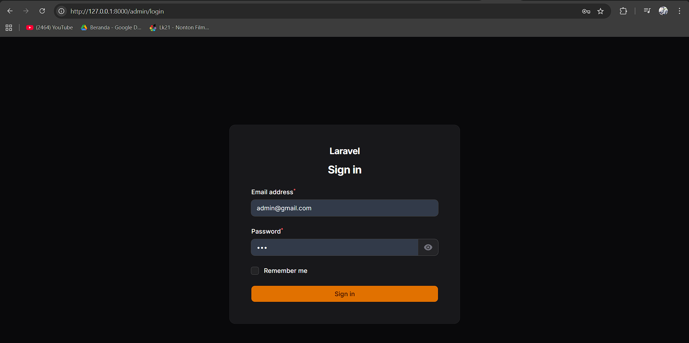
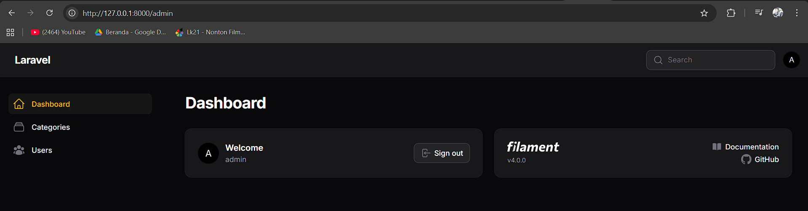
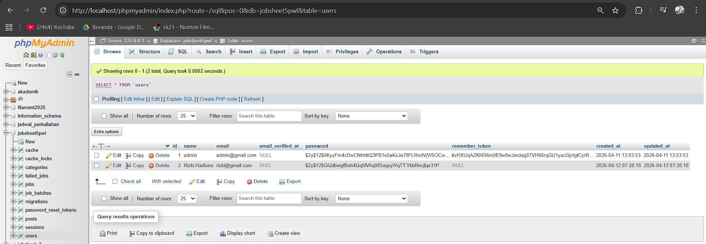

# Laporan Praktikum Pemrograman Web Lanjut
**Topik: Instalasi dan Setup Filament PHP v4 pada Laravel 11**

**Nama:** [Mokhamad Rizki Hadiono Singgih]  
**NIM:** [ 244107020198 ]  
**Kelas:** [ TI-2F ] 

---


## Langkah Instalasi dan Pekerjaan Praktikum

1. **Membuat Project Laravel**
   Project diinisialisasi melalui perintah Composer dengan penamaan folder `PraktikumPWL`:
   ```bash
   composer create-project laravel/laravel PraktikumPWL
   ```

2. **Konfigurasi Database MySQL**
   Database telah diubah format koneksinya di file `.env` untuk menggunakan MySQL, dengan nama database `Filament2026`. Perintah `php artisan migrate` dijalankan setelah database kosong dibuat di phpMyAdmin.

3. **Install Filament v4 & Panel Builder**
   Instalasi library package inti Filament dilakukan menggunakan baris kode:
   ```bash
   composer require filament/filament:"^4.0"
   php artisan filament:install --panels
   ```

4. **Membuat User Admin**
   User Admin dicreate via CLI menggunakan perintah khusus `php artisan make:filament-user`. Sesuai tugas, **dua user admin** telah dibuat.

5. **Menjalankan Aplikasi**
   Local server dijalankan menggunakan `php artisan serve` (atau memanggil spesifik path executable PHP-nya jika diperlukan) lalu admin panel diakses pada URL `http://localhost:8000/admin`.

---

## Kendala yang Ditemukan dan Solusinya

**Kendala:** 
Muncul error `The "intl" PHP extension is required to use the [format] method` atau masalah ekstensi `ext-zip` yang hilang pada versi instalasi PHP secara default (*misal: bawaan terminal dari Herd Lite*).

**Solusi:**
Filament membutuhkan ekstensi `intl` agar bisa memformat data nilai currency, string tanggal, maupun angka. Saya menyelesaikan masalah ini dengan **mengaktifkan ekstensi `intl` (dan `zip` jika perlu) di file `php.ini`** pada *environment* PHP yang memiliki build library ext lengkap (seperti PHP bawaan instalasi XAMPP ver 8.2/8.3). Langkah mitigasi akhir melibatkan eksekusi `composer update` memakai file spesifik `php.exe` XAMPP agar dependensi library ikut sinkron dengan ekstensi yang aktif.

---

## Hasil Praktikum

**1. Halaman Login**  


**2. Dashboard**  


**3. Data User di Database**  


---

## Jawaban Analisis & Diskusi

1. **Apa kelebihan Filament dibanding membuat admin panel manual?**
   **Jawab:** Waktu _development_ dijamin berkurang secara drastis (sangat masif). Filament secara reaktif membuat pondasi UI _Dashboard_, tabel pencarian, autentikasi, serta _form view_ dan integrasinya pada basis data melalui interkoneksi komponen **Livewire** & **Alpine.js** siap pakai. Kita tidak perlu lagi repot merancang frontend _blade HTML_ atau memikirkan Controller logika CRUD standar dari nol.

2. **Mengapa Filament menggunakan Livewire?**
   **Jawab:** Karena Livewire memfasilitasi model interaktif *SPA (Single Page Application)* yang mulus bagi PHP developer tanpa perlu menyentuh kerumitan setup JavaScript framework mandiri seperti Vue atau React. Livewire menangani request interaktif (seperti tombol submit, validasi real-time form, sorting tabel) tanpa me-*reload* seluruh halaman browser secara penuh, mempertahankan UX panel *Dashboard* menjadi amat dinamis.

3. **Apa perbedaan SQLite dan MySQL dalam development?**
   **Jawab:** 
   - **SQLite** adalah database sistem berbasis *file* lokal murni yang tertanam di *file system*. Amat mudah serta tak perlu di-install proses mandiri, cocok untuk uji coba *testing* cepat dan instalasi aplikasi skala kecil/belajar.
   - **MySQL** berjalan melalui sistem *client-server* relational yang kompleks. Dapat menangani trafik tinggi dan *concurency* besar, mendukung skalabilitas data, cocok dan disarankan untuk environtment produksi betulan dan *enterprise*.

4. **Apa fungsi Panel Builder?**
   **Jawab:** Panel Builder pada ekosistem Filament bertugas mengemas (men-*scaffold*) kerangka dasar layout utuh halaman admin. Ia mengurus penyediaan rute proteksi default `/admin`, form otorisasi login, menu navigasi *sidebar sidebar*, hingga manajemen konfigurasi multi-dashboard (Panel) jika sebuah aplikasi memiliki level domain UI beragam misal satu panel untuk admin dan satu sub-panel lain terpisah (seperti portal manajer operasional).

---
*Laporan Praktikum Pemrograman Web Lanjut - Framework Filament v4*