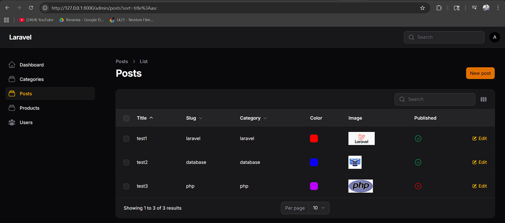
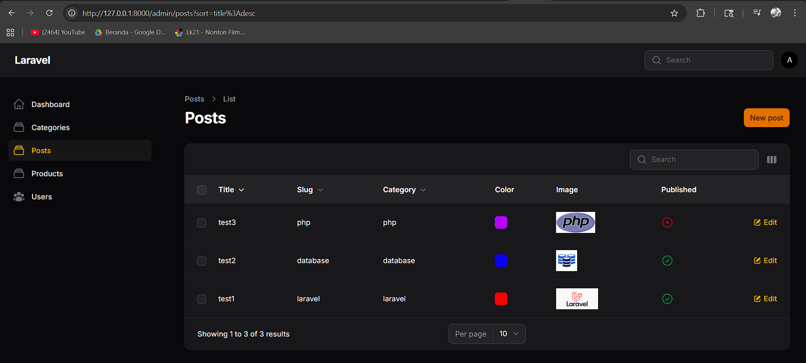
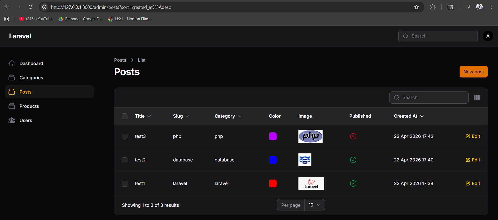

# Laporan Praktikum Pemrograman Web Lanjut
**JobSheet-10 Pertemuan 10 – Implementasi Sorting (Ascending & Descending) pada Table Filament**

**Nama:** [Mokhamad Rizki Hadiono Singgih]  
**NIM:** [ 244107020198 ]  
**Kelas:** [ TI-2F ]   

---

## Implementasi Tugas Praktikum

Praktikum kali ini bertujuan untuk menaikkan skala skalabilitas dan aksesibilitas data (*Data Management*) pada modul `Post` dengan menerapkan fungsionalitas algoritma **Sorting**. Implementasi dilakukan pada fail tabel terpisah yaitu `app/Filament/Resources/Posts/Tables/PostsTable.php`.

Berikut implementasi penambahan _method_ `->sortable()` dan `->defaultSort` yang sudah saya selesaikan:

### 1. Deklarasi `defaultSort()`
Untuk memastikan pengguna selalu melihat Post yang *terbaru pertama kali*, kita set *default sorting* keseluruhan tabel langsung pada object table dengan mendefinisikan *key* `created_at` (kolom tanggal lahir data) dalam format descending (`desc`).

```php
public static function configure(Table $table): Table
{
    return $table
        ->defaultSort('created_at', 'desc')
        ->columns([
            // ...
        ])
        // ...
}
```

### 2. Penambahan `sortable()` pada Seluruh Kolom Target
Saya melakukan integrasi `->sortable()` tidak hanya pada kolom teks konvensional, tapi juga pada kolom relasi (Foreign Key) yakni `category.name` serta kolom tanggal `created_at` yang baru saja disisipkan dengan _DateTime formatting_.

```php
->columns([
    TextColumn::make('title')
        ->searchable()
        ->sortable(), // Praktikum 1: Aktifkan sorting pada Title
        
    TextColumn::make('slug')
        ->sortable(), // Praktikum 1: Aktifkan sorting pada Slug
        
    TextColumn::make('category.name')
        ->sortable(), // Sorting cerdas pada relasi join
        
    ColorColumn::make('color'),
    ImageColumn::make('image')->disk('public'),
    IconColumn::make('published')->boolean(),
    
    TextColumn::make('created_at')
        ->label('Created At')
        ->dateTime('d M Y H:i')
        ->sortable() // Digunakan oleh Default Sort
        ->toggleable(isToggledHiddenByDefault: true),
])
```

---

## Hasil Praktikum

* **Sorting Title Ascending (A-Z):** 


* **Sorting Title Descending (Z-A):**  
 

* **Sorting Date Descending (Default Terbaru):**  


---

## Jawaban Analisis & Diskusi

1. **Mengapa sorting penting pada admin panel?**
   **Jawab:** Dalam skala *enterprise*/dunia nyata, volume baris di basis data bisa mencapai puluhan ribu *records*. Fitur *Sorting* bekerja krusial menjadi alat penyaring kasat mata bagi sistem navigasi admin (*Dashboard Filtering*) untuk sekadar meninjau lonjakan pola tanpa perlu mengetikkan *Query* secara spesifik, sehingga proses monitoring maupun mencari _item_ tertua—yang mungkin butuh perhatian—bisa ditemukan hanya dalam satu kali _click_ pada _Header_.

2. **Apa perbedaan sortable biasa dengan defaultSort()?**
   **Jawab:**
   - `->sortable()`: Membuka _flag/permission_ pada satu spesifik kolom agar ia *bisa* diklik dari _UI Header Tabel_ oleh pengguna untuk mensortir data (`ORDER BY...`).
   - `->defaultSort('col_key', 'order')`: Bergerak murni di belakang layar. Modifikasi statis yang menyuruh _Laravel Query Builder_ langsung men-sorting inisialisasi tabel tersebut sejak pertama proses render HTML, walau belum diapa-apakan *user*.

3. **Mengapa relasi tetap bisa di-sort?**
   **Jawab:** Hal ini dimungkinkan oleh kejeniusan optimasi *Filament* (diusung oleh arsitektur Eloquent) yang dengan cermat membaca adanya *dot-notation* seperti `category.name`. Secara mulus Filament membuang sistem pengambilan statis konvensional dan meneruskan query tersebut agar membuat susuan kalimat SQL berupa *Left Join / Inner Join* antara tabel utamanya (`posts`) dan tabel relasinya (`categories`), lalu secara harfiah memberlakukan `ORDER BY categories.name`.

4. **Kapan kita menggunakan desc sebagai default?**
   **Jawab:** _Descending (DESC)_ biasanya mutlak digunakan sebagai opsi awal (default) untuk antarmuka yang sensitif terhadap "Waktu", terutama dengan key kolom seperti `created_at` (terbaru), `updated_at` (terakhir kali diaudit), dsb. Kebalikannya, _Ascending (ASC)_ kerap digunakan oleh tipe halaman relasional leksikal yang memajang semacam Kamus, Daftar Nama Karyawan Berabjad, maupun Harga Termurah.
   
---
*Laporan Praktikum Pemrograman Web Lanjut - Framework Filament v4*
