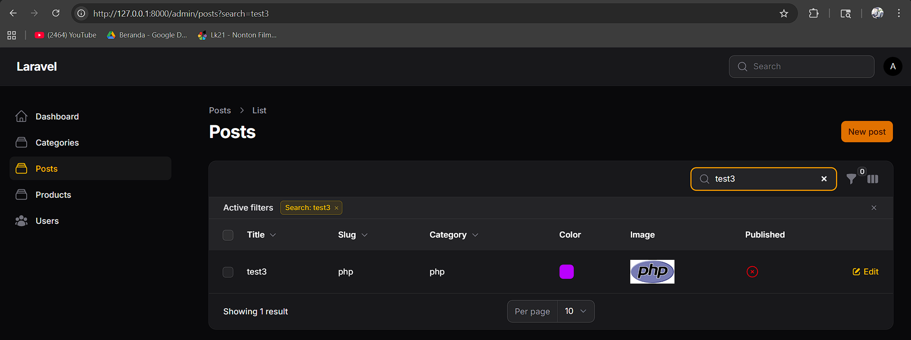
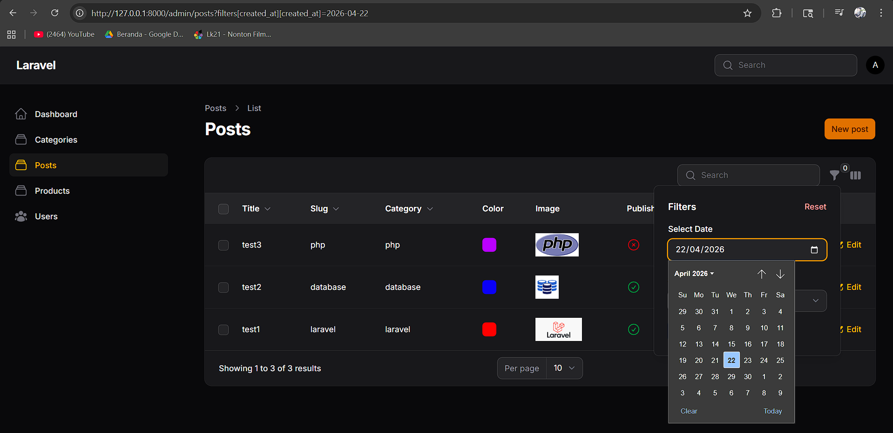
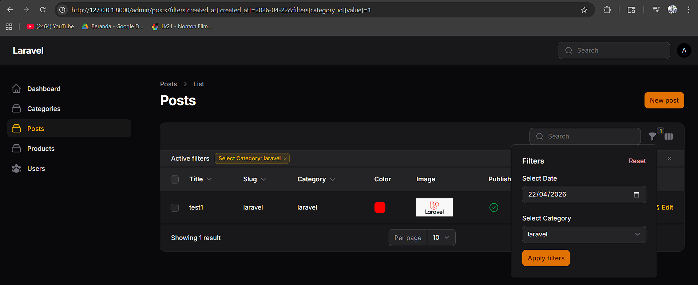

# Laporan Praktikum Pemrograman Web Lanjut
**JobSheet-11 Pertemuan 11 – Implementasi Search & Filter pada Table Filament**

**Nama:** [Mokhamad Rizki Hadiono Singgih]  
**NIM:** [ 244107020198 ]  
**Kelas:** [ TI-2F ]   

---

## Implementasi Tugas Praktikum (Search & Filter)

Praktikum kali ini bertujuan untuk meningkatkan fungsionalitas pencarian data dan penyaringan (*Filtering*) pada tabel `Post`. Implementasi mencakup penambahan fungsionalitas `searchable()` pada beberapa text column, serta konfigurasi filter (Tanggal dan Relasi) dengan memodifikasi tabel di `app/Filament/Resources/Posts/Tables/PostsTable.php`.

Berikut rincian implementasinya:

### 1. Mengaktifkan fitur pencarian
Fungsi `->searchable()` ditambahkan ke tiga kolom utama, yaitu `title`, `slug`, dan juga kolom relasi `category.name` agar pengguna dapat mencari keyword berbasis teks secara *real-time*.
```php
TextColumn::make('title')->searchable()->sortable(),
TextColumn::make('slug')->searchable()->sortable(),
TextColumn::make('category.name')->searchable()->sortable(),
```

### 2. Membuat Filter Tanggal
Agar pengguna dapat menyaring data pembuatan dengan presisi hari, sebuah *Date Filter* telah diimplementasikan dalam struktur blok `filters()`. Logika ini dikonfigurasi menggunakan komponen formulir `DatePicker` serta ditangani menggunakan modifikasi penambahan baris kueri kustom (Custom Query Filter) via `whereDate`.
```php
Filter::make('created_at')
    ->label('Creation Date')
    ->schema([
        DatePicker::make('created_at')
            ->label('Select Date'),
    ])
    ->query(function ($query, array $data) {
        return $query->when(
            $data['created_at'],
            fn ($query, $date) => $query->whereDate('created_at', $date)
        );
    }),
```

### 3. Membuat Filter Kategori
Sebuah tipe penyaring `SelectFilter` diterapkan untuk menjembatani pemilihan opsi yang merujuk pada tabel relasi kategori. Penggunaan metode `->relationship()` dan `->preload()` memastikan daftar menu kategori (*Dropdown*) ditarik otomatis dari tabel asal dengan efisien.
```php
SelectFilter::make('category_id')
    ->label('Select Category')
    ->relationship('category', 'name')
    ->preload(),
```

---

## Hasil Praktikum

* **Screenshot Search Title:**  


* **Screenshot Filter Tanggal (Date):**  
  

* **Screenshot Filter Kategori (Select):**  


---

## Jawaban Analisis & Diskusi

1. **Mengapa search tidak cocok untuk filter tanggal?**
   **Jawab:** Fitur *search* (menggunakan fungsi text `searchable()`) mencari untaian teks *(string matching)* menggunakan perintah pangkalan data berbasis *SQL LIKE `(%keyword%)`*. Format waktu dan penulisan standar tanggal di MySQL (`Y-m-d H:i:s`) di tabel dengan format teks lokal inputan pengguna *(misal pengguna mengetik "11 Mei")* akan sangat jauh meleset (berbeda). Sangat tidak efisien dan kurang logis jika mesin dituntut membandingkan string teks pada data presisi rentang temporal; dibutuhkan logika khusus manipulasi tanggal bukan pencarian huruf demi huruf.

2. **Apa fungsi relationship() pada SelectFilter?**
   **Jawab:** Fungsi `relationship('nama_relasi', 'kolom_ditampilkan')` memudahkan proses pemanggilan integratif *Lookup list* form Dropdown tanpa query mendayung secara manual. Ia secara otonom menyusuri fungsi public relasi di Model Post (misal method `category()`), lalu mengambilkan Primary Key untuk referensi kalkulasi *filtering* *back-end* serta meminjam atribut `name` dari tabel kategori referensinya untuk dipertontonkan elegan sebagai Menu Pilihan visual (UI) di Panel Filter yang bisa *preload*.

3. **Mengapa kita perlu whereDate() pada query filter?**
   **Jawab:** Kolom tipe `created_at` di dalam struktur pangkalan data memiliki format ganda bawaan `timestamp` (tanggal lengkap beserta jam, misalnya `2024-05-10 14:30:00`). Ketika pihak pengguna memakai input UI `DatePicker`, nilainya hanya menyuplai dan membalap bagian tahun bulan dan harinya saja (`2024-05-10`). Fungsi spesifik `whereDate()` secara instan memberlakukan kalkulasi dan memotong porsi durasi ekstra spesifik (jam, menit, detik) dan hanya mengolah murni harinya supaya sejajar *(equal)*. Jika cuma menggunakan murni klausa `where('created_at', date)`, maka akan dianggap tidak cocok (`false mismatch`) karena `where 2024-05-10 14:30:00 == 2024-05-10 00:00:00` selalu tidak pernah sama, sehingga filter tidak akan pernah bisa menampilkan data hasil satupun.

4. **Apa perbedaan searchable() dan filters()?**
   **Jawab:** 
   - **`searchable()`:** Merupakan fungsionalitas instan yang membangkitkan satu bingkai universal *Global Search Input Bar* (berbasis text lurus). Filament akan meracik sistem yang menerka pencarian teks *(wildcard search)* pada keseluruhan sel / pilar parameter yang ditandai *searchable* di waktu instan bersamaan (Kueri komposit *OR LIKE* yang masif secara Horizontal dan dinamis saat kita *live typing*).
   - **`filters()`:** Fitur ini diatur jauh lebih teratur spesifik (Logika Kueri Kombinasi Verikal). Mekanisme interaksinya melampiaskan Form-Form penyaringan di luar text manual tak terbatas semacam (Penyeleksian Status Checkbox *Toggle*, Seleksi Dropdown referensi luar `SelectFilter`, atau form presisi waktu `DatePicker`). Pengguna menyeting paramater bertumpuk spesifik di luar kolom yang tersedias dan memicu kalkulasi pencarian final dari penekanan tombol komitmen *Apply*. 

---

## Kesimpulan
Pada pertemuan ini, implementasi esensial skalabilitas _Data Table Management_ dari modul _Listing_ Post Filament v4 telah berhasil kita mantapkan. Meluncurkan implementasi *Global Search Bar* dengan inisiasi berantai instan fungsi `searchable()` memperkuat fleksibilitas temu data teks liar. Perangkat penyaringan masif disempurnakan lagi selaras dengan injeksi modul `filters()`, di mana rentang validasi parameter ketat (*DatePicker* pada *Custom Query* dan *Select Filter Relationship* kategori) saling berkesinambungan. Kesatuan kedua model integrasi _front-end_ Filament tersebut menyanggupi tuntutan pengolahan data ribuan baris *(filtering data logic)* dengan tata laksana eksekusi yang praktis, kustomisabel dan sangat bertenaga.

---
*Laporan Praktikum Pemrograman Web Lanjut - Framework Filament v4*
