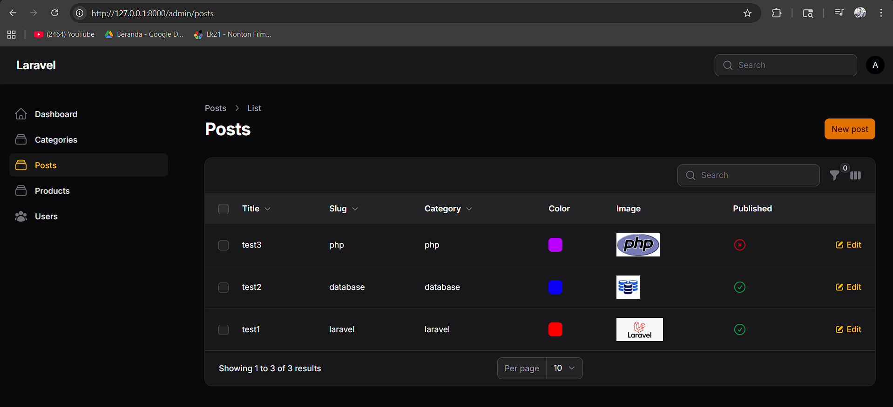
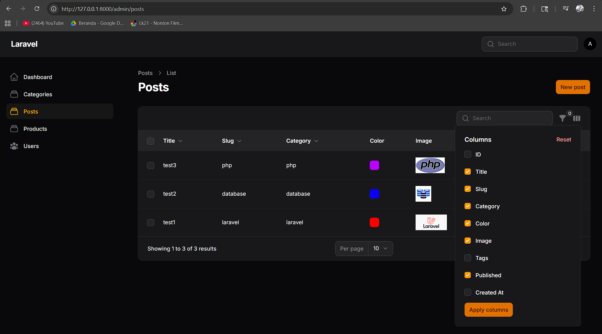
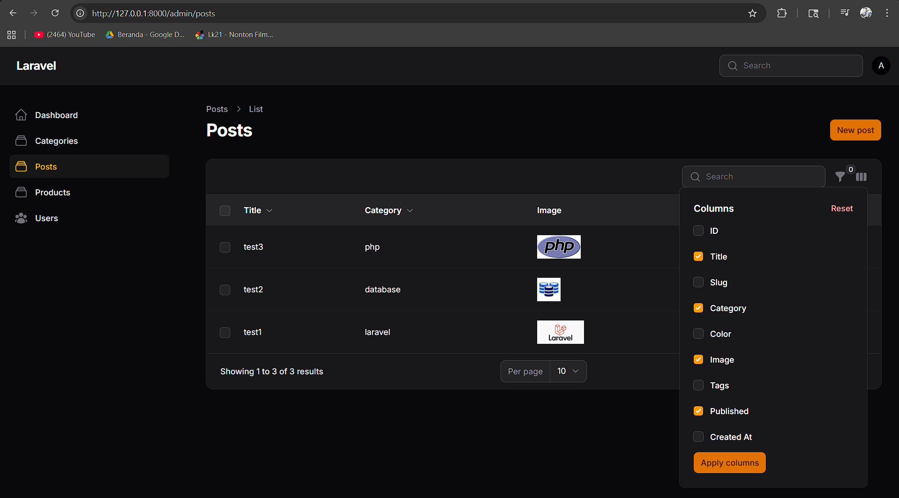
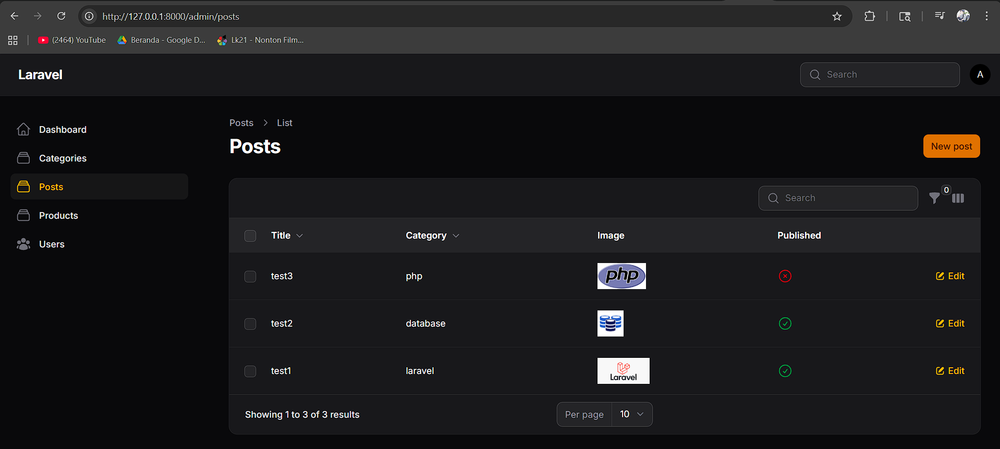

# Laporan Praktikum Pemrograman Web Lanjut
**JobSheet-12 Pertemuan 12 – Implementasi Toggle Column pada Table Filament**

**Nama:** [Mokhamad Rizki Hadiono Singgih]  
**NIM:** [ 244107020198 ]  
**Kelas:** [ TI-2F ]   

---

## Implementasi Tugas Praktikum (Toggle Column)

Praktikum kali ini bertujuan untuk meningkatkan keleluasaan antarmuka pengguna *(Customizability)* serta mengontrol keterbatasan dimensi layar *(Responsive UI)* saat meninjau tabel data dengan atribut/kolom yang semakin berjejal.  Fitur ini diimplementasikan ke dalam format manajemen Tabel Manajemen Produk di target modifikasi file `app/Filament/Resources/Posts/Tables/PostsTable.php`.

Berikut tahapan implementasi `Toggle Column` yang telah saya kerjakan:

### 1. Menambahkan Kolom Pelengkap (`id` & `tags`)
Ditambahkan dua *Text Column* suplementari baru guna simulasi kolom padat. Kolom ID *(Primary Key)* serta Kolom Tags *(Text)* sengaja diregistrasikan dengan visibilitas otomatis tersembunyi.
```php
TextColumn::make('id')
    ->label('ID')
    ->toggleable(isToggledHiddenByDefault: true),
    
TextColumn::make('tags')
    ->label('Tags')
    ->toggleable(isToggledHiddenByDefault: true),
```

### 2. Mengaktifkan `toggleable()` pada Seluruh Kolom
Keseluruhan kolom yang selama ini bersifat statis (Paten) direntangkan properti fungsional tambahannya dengan `->toggleable()`. Kini, *user* bisa memutuskan elemen visual mana yang menurutnya layak tayang di mejanya.
```php
TextColumn::make('title')->searchable()->sortable()->toggleable(),
TextColumn::make('slug')->searchable()->sortable()->toggleable(),
TextColumn::make('category.name')->searchable()->sortable()->toggleable(),
ColorColumn::make('color')->toggleable(),
ImageColumn::make('image')->disk('public')->toggleable(),
IconColumn::make('published')->boolean()->toggleable(),
// Serta toggle isToggledHiddenByDefault:true ke kolom id, tags, dan created_at.
```

---

## Hasil Praktikum

* **Tampilan Sebelum Toggle (Default View):**  


* **Menu Toggle Kolom (Dropdown Switch):**  
 

* **Tampilan Setelah Beberapa Kolom Disembunyikan (Modified View):**  




---

## Jawaban Analisis & Diskusi

1. **Mengapa toggle column penting pada admin panel?**
   **Jawab:** Desain arsitektur UI sebuah admin panel kerap menemui masalah klasik berupa *Visual Clutter* (layar penuh sesak text). Di tabel yang mewakili 20-30 kolom di basis data, merepresentasikan semuanya sekaligus dapat membuat lebar layar horizontal tidak proporsional dan data bertabrakan *(horizontal scrolling error)*. `Toggle Column` berfungsi sebagai instrumen vital manajemen visibilitas personal bagi Administrator; admin finansial mungkin hanya peduli melihat kolom `'Harga'` dan `'Stok'`, sementara Admin SEO/Sosmed hanya mensentang kolom `'Title'` dan `'Slug'`.

2. **Apa perbedaan toggleable() biasa dengan isToggledHiddenByDefault?**
   **Jawab:**
   - `->toggleable()` secara murni mengizinkan suatu kolom masuk list daftar *Columns Dropdown*. Namun, state / status awalnya ketika user pertama kali menjejak di tabel tetap dalam posisi tercentang *(Visible)*.
   - `->toggleable(isToggledHiddenByDefault: true)` memberikan izin masuk *columns list*, dan membalikkan inisiasi standarnya agar ketika user baru datang, kolom ini justru terlempar/diklasifikasikan ke dalam keadaan **Tidak Dicentang (*Hidden / Invisible*)**. Kolom ini menunggu diaktifkan manual secara swadaya.

3. **Mengapa preferensi kolom tetap tersimpan?**
   **Jawab:** Framework perancang Tabel (seperti Filament / Livewire / Alpine) mendelegasikan state visibilitas yang dikoordinasikan setiap *browser client* kepada **Local Session / State Manager**. Saat user men-*toggle* satu nilai, framework merekam susunan Array/Bool itu berdiam sementara pada *Browser LocalStorage/Cookies* (atau *Backend User Session*). Sehingga meski pengguna melakukan klik F5 (*Refresh*) form akan membaca ulang *"Oh, untuk PC admin ini, kolom ID memang ia sembunyikan"* dan meniadakan proses *re-render* ulangnya.

4. **Kapan sebaiknya kolom disembunyikan secara default?**
   **Jawab:** Praktik ini wajib diterapkan untuk:
   1) Data *Sensitive/Back-end* (seperti `ID` Primary Key di atas atau Token).
   2) Data berumur panjang (*Log/Auditing* kolom seperti `created_at`, `updated_at`, `deleted_at`).
   3) Meta text/Beban besar (*Summary Description/Article Post Content* penuh).
   4) Array *JSON casted fields* seperti *Tags*. 
   Secara prinsip, semua yang bukan prioritas visual (Bukan nama identitas pokok barang/title) lebih terhormat dibuat *"Hilang by default"*.

---

## Kesimpulan

Pada pertemuan ke-12 ini, modifikasi struktural berpusat pada penempaan skema desain UI di komponen tabel (Frontend Display Logic) yang ramah *User Experience (UX)*. Mahasiswa dilatih memakai properti peraga UI dinamis: `Toggle Column`. Pembelajaran utamanya bertolak pada penambahan kendali visibilitas *real-time* kepada masing-masing *user administrator*, pencatutan parameter persetujuan default pe-nol-an tampilan (*isToggledHiddenByDefault*), formasi pembuktian penyimpanan sesi navigasi form via *Local Session*, serta penerapan *IconColumn boolean* fungsionalis. Kombinasi tersebut mengikis kekacauan baris layar dari sistem padat entitas dan mengokohkan Filament sebagai medium kontrol data raksasa.

*Laporan Praktikum Pemrograman Web Lanjut - Framework Filament v4*
