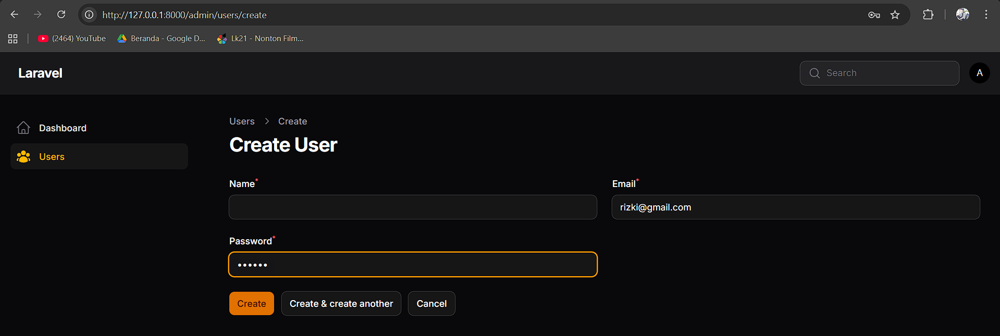

# Laporan Praktikum Pemrograman Web Lanjut
**JobSheet-13 Pertemuan 13 – Implementasi Table Actions & Custom Action di Filament**

**Nama:** [Mokhamad Rizki Hadiono Singgih]  
**NIM:** [ 244107020198 ]  
**Kelas:** [ TI-2F ]   

---

## Implementasi Tugas Praktikum (Table Actions)

Praktikum kali ini bertujuan untuk meningkatkan kecepatan manajemen operasional (*action*) data langsung dari antarmuka halaman indeks/tabel, tanpa harus bolak-balik memasuki form _Edit/Create_. Pengerjaan difokuskan pada file penyuplai kerangka tabel `app/Filament/Resources/Posts/Tables/PostsTable.php`.

Berikut detail rincian modifikasi pada baris `->recordActions([ ... ])`:

### 1. Menambahkan Bawaan Delete & Replicate Action
Dalam metode *table actions* Filament, kita dapat mengadopsi fungsionalitas lazim *(CRUD & Duplication)* hanya dalam satu baris deklarasi. Saya menambahkan injeksi kelas `DeleteAction` dan `ReplicateAction` untuk memunculkan tombol hapus instan *(dengan modal konfirmasi aman)*, dan tombol pelipatganda (Kloning) *record*.
```php
recordActions([
    EditAction::make(),
    DeleteAction::make(),
    ReplicateAction::make(),
    // ...
```

### 2. Membuat Custom Action (Ubah Status Publish)
Selain dari fungsi gawan, Filament sangat terbuka untuk injeksi skrip Form kustom menggunakan kelas `Action::make()`. 

Skenario penerapannya berupa pembuatan mekanisme alih status *Published* ke *Unpublished* langsung di satu baris tabel tersebut, lengkap dengan ikon, modal interaktif dengan *Checkbox* (bernilai basis data berjalan ditarik dari `$record->published`), dan operasi `->update()` Eloquent terpadu yang didorong oleh *callback anonymous*.
```php
Action::make('status')
    ->label('Status Change')
    ->icon('heroicon-o-check-circle')
    ->requiresConfirmation() // Confirmation Modals
    ->schema([
        Checkbox::make('published')
            ->default(fn ($record): bool => (bool) $record->published),
    ])
    ->action(function ($record, array $data) {
        $record->update(['published' => $data['published']]);
    }),
```

---

## Hasil Praktikum

* **Tombol Delete di Tabel:**  



* **Tombol Replicate Action:**  
 


* **Tombol Custom Action Status & Konfirmasinya:**  
 


---

## Jawaban Analisis & Diskusi

1. **Mengapa action di tabel lebih efisien dibanding halaman edit?**
   **Jawab:** Karena memangkas waktu (*time overhead*) rutinitas pergantian/navigasi routing. User tak perlu menembus proses perpindahan HTTP *Request* ke _Page_ berbeda, me-render tampilan form rumit, menyentuh tombol target, dan kemudian me-redirect ulang ke Index Table. Semua dipampat melalui *AJAX / Livewire calls* mulus berbasis asinkron pada layar yang tidak pernah ter-interupsi (Tetap berada di UI Grid Indeks Data). Ini mendongkrak kecekatan manipulasi *record* berjumlah besar.

2. **Apa perbedaan predefined action dan custom action?**
   **Jawab:**
   - **`Predefined Action`:** Aksi pabrikan mutlak dari Filament (*DeleteAction, EditAction, ReplicateAction*) yang diiringi oleh serangkaian logika belakang panggung bawaan baku (Misalnya `DeleteAction` sudah pasti melenyekkan baris via Eloquent *destroy* di DB dan `ReplicateAction` menyalin relasi).
   - **`Custom Action`:** Dideklarasikan melalui `Action::make('name')`. Ini adalah metode manipulatif tangan kosong *Blank Canvas*. Seluruh penamaan, pemicu form, hingga fungsi operasi modifikasi (*Logic Flow* / *Database update*) ditentukan secara bebas (mutlak manual rancangan Programmer).

3. **Bagaimana cara menambahkan validasi dalam custom action?**
   **Jawab:** Filament sudah mengikat arsitektur form ke dalam form skema aksi kustom `schema([...])`, validasi bisa diletakkan selayaknya seperti melakukan validasi reguler kolom Model: yakni mengaitkan langsung pada rantaian blok tipe datanya. Contoh:
   `TextInput::make('stok')->required()->numeric()->minValue(1)` .
   Pihak Livewire akan memvalidasi *rules* tersebut sebelum pernah menjejak sampai di blok eksekusi penutup `->action(fn (...) { ... })`.

4. **Kapan kita menggunakan Replicate?**
   **Jawab:** Digunakan ketika administrator dituntut untuk membuat *(Entry)* masukan baru dan rekam jajaknya 80%-90% persis menyerupai sebuah entitas yang sudah dipunyai sebelumnya (Sangat berguna untuk menyusun data *Product Variant*, entri Blog Bersambung, Invoice Duplikasi/Retur, dll). Replikasi menghilangkan paksaan *"Membangun seluruh teks/form raksasa spesifik"* hanya untuk menciptakan duplikat berlabel berbeda sedikit (sangat efisien di dunia nyata pengelolaan Produk Katalog).

---

## Kesimpulan

Pada Pertemuan-13 ini, kepraktisan skema antarmuka Admin (*Administrator Agility*) dioptimalisasikan lewat materi operatif: *Table Actions*. Pelajaran mengcover pendampingan kelas-aksi prarekam seperti hapus instan `DeleteAction` serta rekaan kembaran `ReplicateAction`. Di puncak kelincahannya, skema `Action` diset kustom dengan menyematkan komponen Form mungil dan fungsionalitas pembaruan data *inline* mandiri, membuktikan kehebatan framework Filament dalam membabat pekerjaan operasional CRUD repetitif menjadi semudah dan se-instan menekan modal klik ganda (*Micro-interactions*).

*Laporan Praktikum Pemrograman Web Lanjut - Framework Filament v4*