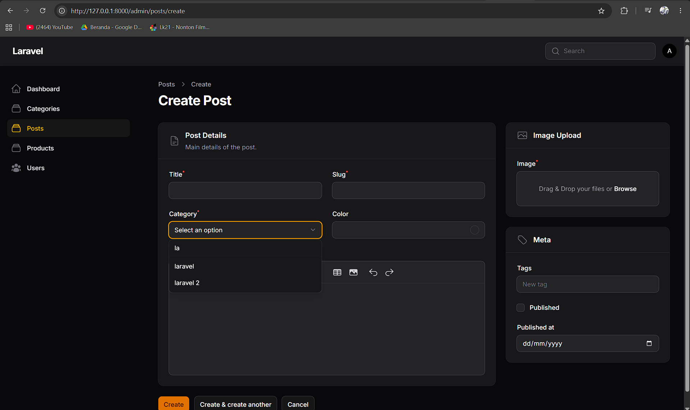
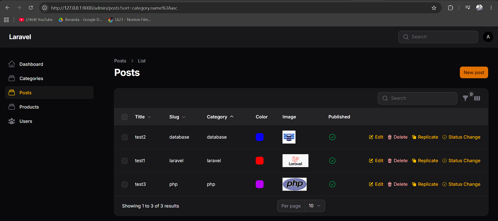
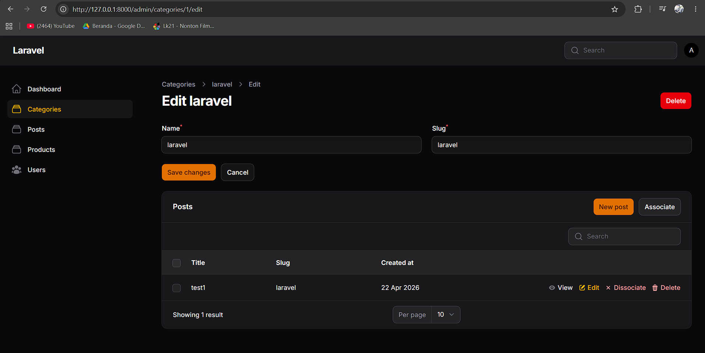
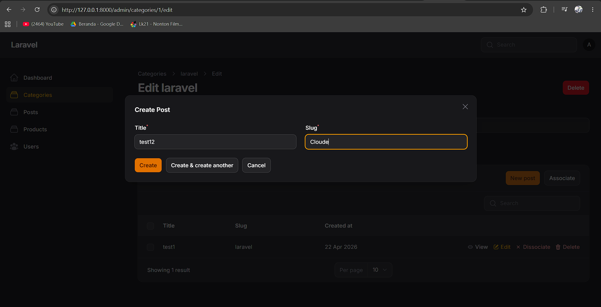
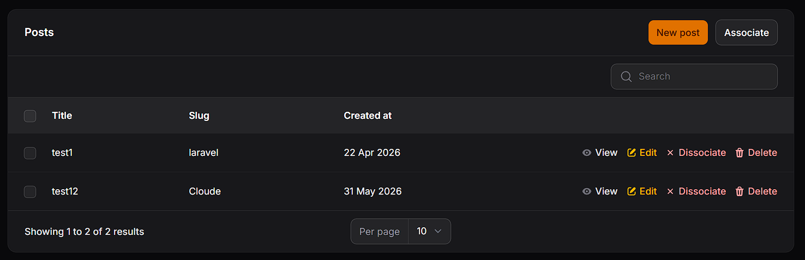

# Laporan Praktikum Pemrograman Web Lanjut
**JobSheet-14 Pertemuan 14 – Implementasi Relation pada Filament (HasMany)**

**Nama:** [Mokhamad Rizki Hadiono Singgih]  
**NIM:** [ 244107020198 ]  
**Kelas:** [ TI-2F ]   

---

## Implementasi Tugas Praktikum (Model Relationships)

Praktikum untuk mengintegrasikan jembatan relasi pangkalan data antar tabel (*Table Relationships*), khususnya _One-to-Many_ (`HasMany` / `BelongsTo`), dan melimpahkannya secara interaktif ke lingkungan antarmuka Filament Admin. Fokus implementasi mencakup koneksi antara form input (`Select`), visualisasi data pada tabel rekaman, serta instansiasi *Relation Manager* terintegrasi.

Berikut tahapan implementasi integrasi relasi yang telah diselesaikan:

### 1. Implementasi Dropdown Relationship (Post Form)
Elemen *Select field* `category_id` yang tadinya menggunakan pemuatan rekaman konvensional PHP masif digantikan dengan performa *Livewire Relationship Query*. Ditambahkan properti `->relationship('category', 'name')` untuk merajut koneksi Eloquent, beserta dukungan instan *pencari data* `->searchable()` untuk menanggulangi penumpukan daftar Dropdown Category bila sudah mencapai data berukuran raksasa.
```php
Select::make('category_id')
    ->label('Category')
    ->relationship('category', 'name') // Mengikat ke method model
    ->searchable() // Mengaktifkan text search real-time
    ->required(),
```

### 2. Formasi Menampilkan Kategori di Tabel (Post Table)
Visualisasi konjungsi telah dituntaskan dengan memastikan ketersediaan pembaca *dot-notation* relasional (pengambilan referensi antartabel langsung di *UI Table*) pada elemen Kolom Teks Post (sudah diimplementasikan sejak Jobsheet terdahulu). Hal ini memungkinkan baris sel merujuk langsung ke kepemilikan string nama tabel Category tanpa query gabungan *Join* tertulis.
```php
TextColumn::make('category.name')
   ->searchable()->sortable()->toggleable(),
```

### 3. Eksekusi Relational Form Manager (Relation Manager)
Digunakan perintah _Generator_ Artistan kustom Filament untuk mendirikan ekosistem terpadu antar halaman: `php artisan make:filament-relation-manager CategoryResource posts title`. Modul Relation Manager ini ditanamkan di halaman bawah milik Detail Modul Category Resource—memberikan kemampuan agar *form Create dan Edit Data Category* turut meng-hosting *(Host)* tabel bawahan Posts anak-anak perusahaannya (Fitur Sub-Table CRUD). 

Di dalam class `app/Filament/Resources/Categories/RelationManagers/PostsRelationManager.php`, disematkan spesifikasi Form pendiri ganda (Perekam Title dan Slug instan), serta penyuntingan visualisasi List Data pelengkap.
```php
// File RelationManager: Schema Input Mini
public function form(Schema $schema): Schema {
    return $schema->components([
        TextInput::make('title')->required()->maxLength(255),
        TextInput::make('slug')->required()->maxLength(255),
    ]);
}

// File RelationManager: Tabel Mini penampung
public function table(Table $table): Table {
    return $table->recordTitleAttribute('title')
        ->columns([
            TextColumn::make('title')->searchable(),
            TextColumn::make('slug'),
            TextColumn::make('created_at')->dateTime('d M Y'),
        ]) // ...
```
File Manajer relasional mini di atas lantas disuntikkan secara mapan *(Registered)* pada method `getRelations()` di Parent utamanya, yakni `CategoryResource.php`.

---

## Hasil Praktikum

* **Dropdown Kategori (Searchable) pada Post Form:**  


* **Tabel Post dengan Menampilkan Kategori (Joined Category Table):**  
  

* **RelationManager (Tabel Sub-Posts) pada Parent Halaman Category:**  


* **Proses Create Post langsung dari Modal Relation Manager Category:**  



---

## Jawaban Analisis & Diskusi

1. **Apa perbedaan `relationship()` dengan `options()`?**
   **Jawab:** 
   - `->options(...)`: Menyuplai larik *(Array/Collection)* konstan statis secara mendadak kepada Dropdown, hal ini berarti ia merampas *(fetch)* seluruh isi DB yang diperintahkan di waktu perenderan dan memberikannya bulat-bulat. (Contoh: `Category::all()->pluck(...)`). Kurang dinamis.
   - `->relationship('nama_relasi', 'kolom')`: Menciptakan tautan logis yang hidup. Fitur ini menyambungkan mekanisme formulir ke kerangka Eloquent (seperti penghapusan / pembuatan rekor turunan atau pemicu Searchable Ajax) yang di mana kerangka kerjanya tidak akan mendaratkan kueri raksasa (data loading diakal pintar menggunakan perpaduan _lazy-loading_ & pencarian API interaktif).

2. **Mengapa `searchable` penting untuk dataset besar?**
   **Jawab:** Menampilkan *List Dropdown* puluhan ribu data Kategori ke komponen `select` HTML tradisional akan membekukan mesin Browser memori (*Crashes* Web Page). Menautkan `searchable()` akan merubah watak dropdown tersebut untuk tak memuat ribuan daftar list sama sekali. List tersebut hanya akan mendapuk *query Like `%keyword%`* ke basis data (MySQL) bila user **mulai mengetikkan ejaan *(Live Ajax Search)***. Ini menyelamatkan performansi dari segi efisiensi *Memory Loading*.

3. **Apa fungsi Relationship Manager pada Filament?**
   **Jawab:** Berfungsi membudayakan "Keintiman Administratif". Relation Manager menyuntik sebuah komponen Tabel dan instrumen CRUD Form kecil *(seperti jendela baru)* persis di badan form halaman Modul utamanya. Hal ini memperbolehkan pengelolaan entitas anak (*Tabel Detail/Post*) diurus tanpa perlu angkat kaki dari lembar data Tuan/Parent (*Master/Category*) miliknya. Sangat logis secara UX; admin saat mengoreksi Category 'PHP' dapat sekalian mereview post apa saja yang ia wadahi lalu menambah post baru langsung dari sana (Sub-Resource Management). 

4. **Kapan menggunakan HasMany dan BelongsTo?**
   **Jawab:** Keduanya mendeskripsikan *Satu (1) ke Banyak (M/N)*:
   - **`BelongsTo` (Milik Dari):** Dicatatkan di Model Bawahan (*Detail / Post*), yaitu model yang memegang kolom Foreign Key fisik di komputernya (contoh: Punya lajur `category_id`). Menyatakan bahwa banyak bawahan ini merujuk ke satu indukan spesifik.
   - **`HasMany` (Memiliki Banyak):** Dicatatkan di Model Atasan (*Master / Category*). Menyatakan bahwa satu rekaman entitas ini menjadi patron (Induk) tempat menetapnya sekumpulan rekaman model lain yang bernaung di bawah payungnya.

---

## Kesimpulan

Pada Pertemuan ke-14 ini, sistem manajemen Administrator dibongkar ulang agar merengkuh kesakralan _Database RDBMS Concepts_. Skema relasi kardinalitas model _One-to-Many_ diubah tak hanya menjadi sebuah konsep teoretis semata, namun menjadi jembatan visual fungsional: mengikutsertakan kolom relasi `relationship(...)` di form-form entri dan menginjeksi performa `searchable()`. Tak ayal, keahlian terbesarnya dibuktikan melalui penggunaan ekstensi `RelationManager` Filament. Fitur ini mencabut perbatasan kaku antar modul (Post vs Categories) dengan menempatkan mereka pada satu sumbu operasional tatap muka. Pengalaman memanipulasi *Relational Sub-records* tanpa navigasi yang menyusahkan kian memperkuat integritas administrasi data panel *(Unified Relational Hub)*.