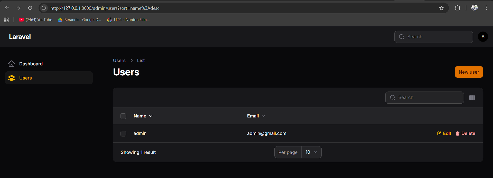
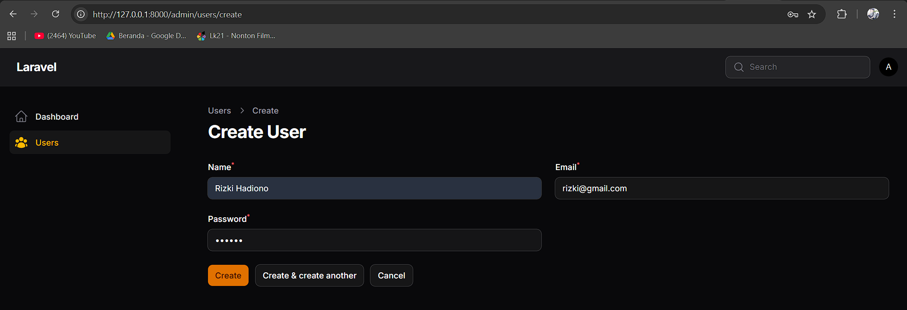
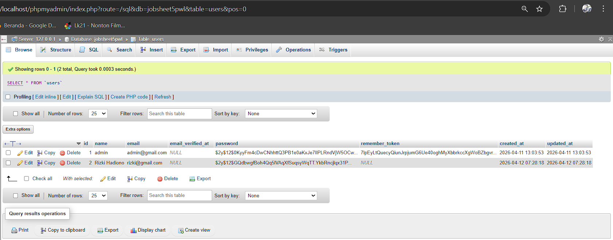

# Laporan Praktikum Pemrograman Web Lanjut
**Jobsheet-5 Pertemuan 2 – Membuat CRUD Resource dengan Filament v4**

**Nama:** [Mokhamad Rizki Hadiono Singgih]  
**NIM:** [ 244107020198 ]  
**Kelas:** [ TI-2F ]  

---


## Implementasi Tugas Praktikum

### 1. Membuat Resource User
Resource `User` dibuat menggunakan logika generator dari Filament melalui perintah artisan terminal. 

### 2. Modifikasi Form Input & Validasi
Sesuai Jobsheet, field form telah diedit untuk menambahkan validasi **Email harus unik** dan **Password minimal 6 karakter**.

*Lokasi: `app/Filament/Resources/Users/Schemas/UserForm.php`*
```php
TextInput::make('name')
    ->required()
    ->maxLength(255),
TextInput::make('email')
    ->email()
    ->unique(ignoreRecord: true) // validasi unik 
    ->required()
    ->maxLength(255),
TextInput::make('password')
    ->password()
    ->required(fn (string $context): bool => $context === 'create')
    ->minLength(6) // validasi min 6 karakter
    ->dehydrated(fn ($state) => filled($state)),
```

### 3. Menambahkan Kolom `created_at` pada Tabel
Menambahkan kolom tanggal registrasi agar dapat ditampilkan / disembunyikan menggunakan fitur Table Builder.

*Lokasi: `app/Filament/Resources/Users/Tables/UsersTable.php`*
```php
TextColumn::make('name')->searchable()->sortable(),
TextColumn::make('email')->searchable()->sortable(),
TextColumn::make('created_at') // Format tambahan kolom
    ->dateTime()
    ->sortable()
    ->toggleable(isToggledHiddenByDefault: true),
```

### 4. Mengganti Icon Menu Resource
Mengubah ikon default `OutlinedRectangleStack` menjadi ikon **UserGroup** menggunakan enum dari kelas Heroicon bawaan Filament.

*Lokasi: `app/Filament/Resources/Users/UserResource.php`*
```php
protected static string|BackedEnum|null $navigationIcon = Heroicon::UserGroup;
```

## Hasil Praktikum

**1. Halaman List User**


**2. Halaman Create User**


**3. Database**


---

## Jawaban Analisis & Diskusi

1. **Mengapa Filament dapat membuat CRUD tanpa banyak coding?**
   **Jawab:** Karena Filament menggunakan ekosistem TALL Stack (Tailwind, Alpine.js, Laravel, Livewire) dan menyediakan kelas object-oriented (Forms & Tables Schema). Filament menggenerasikan komponen View (UI) dan logika Controller secara dinamis via skema kelas tersebut, sehingga developer tidak perlu menulis *boilerplate* kode HTML/Blade dan routing CRUD secara manual.

2. **Apa perbedaan Form Schema dan Table Schema?**
   **Jawab:** 
   - **Form Schema** digunakan untuk membangun struktur UI form input (pembuatan Create dan modifikasi Edit). Kita menentukan field apa saja beserta validasinya.
   - **Table Schema** digunakan untuk membangun antarmuka daftar data (Index/List). Tempat di mana kolom pencarian (searchable), urutan (sortable), dan fungsi hapus massal (bulk actions) dikonfigurasi.

3. **Bagaimana jika kita ingin menambahkan validasi email unik?**
   **Jawab:** Kita cukup menambahkan method `->unique(ignoreRecord: true)` pada komponen `TextInput` email di Form Schema. Parameter opsional `ignoreRecord: true` berguna untuk mengecualikan baris data yang sedang diedit (agar email lamanya diizinkan di-update tanpa memicu peringatan redudan).

4. **Mengapa password tidak perlu kita hash manual?**
   **Jawab:** Karena instalasi Model `User` bawaan Laravel terbaru telah dipasangkan properti model `casts` (berada di file `User.php`) yang menspesifikkan bahwa atribut `password` bertipe `hashed`. Jadi, ketika Filament mengirim/menyimpan data *password* dalam bentuk plain-text ke database, kelas Eloquent Model Laravel secara otomatis akan mengubahnya menjadi enkripsi *hash* (bcrypt/argon2).

---
*Laporan Praktikum Pemrograman Web Lanjut - Framework Filament v4*
