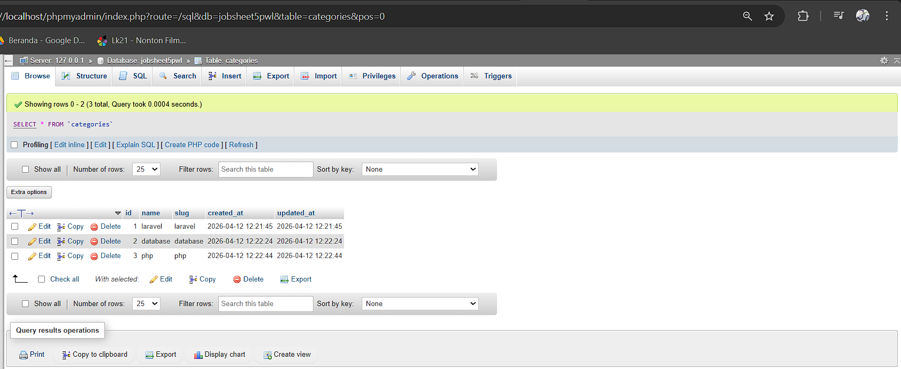
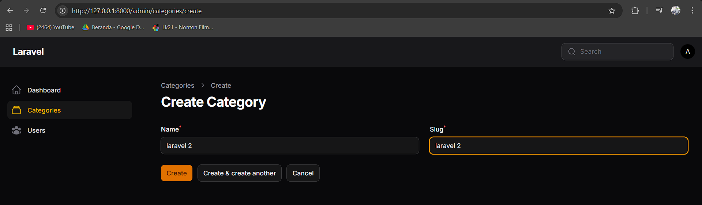
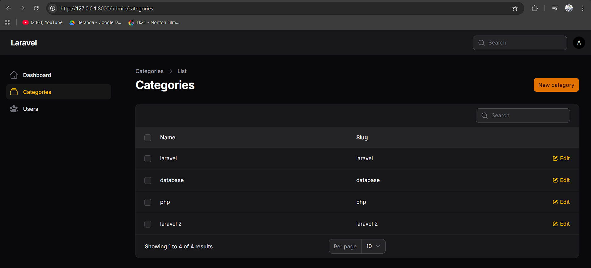

# Laporan Praktikum Pemrograman Web Lanjut
**Jobsheet-5 Pertemuan 3 – Membuat Migration, Model, Relasi & Resource Category**

**Nama:** [Mokhamad Rizki Hadiono Singgih]  
**NIM:** [ 244107020198 ]  
**Kelas:** [ TI-2F ]  

---


## Implementasi Tugas Praktikum

### 1. Desain Struktur Tabel dan Validasi Unik (`Migration`)
Sesuai Jobsheet dan Tugas Praktikum:
- Pada file migrasi `Category`, ditambahkan kolom `name` dan kolom `slug` yang di-set menjadi unik menggunakan validasi *Database Constraint* `->unique()`.
- Pada file migrasi `Post`, tipe data foreign key untuk `category_id` dibangun dengan merelasikannya langsung ke tabel `categories` sekaligus skema *cascade on delete* apabila kategori dihapus.

*Contoh relasi di migrasi posts:*
```php
$table->foreignId('category_id')->constrained('categories')->cascadeOnDelete();
```

### 2. Modifikasi Resource Category Filament (`Form & Table`)
Fitur validasi Form *slug harus unik* dikonfigurasikan di layer aplikasi Filament melalui file `CategoryForm.php`:

```php
TextInput::make('name')
    ->required(),
TextInput::make('slug')
    ->required()
    ->unique(ignoreRecord: true), // Mencegah duplikasi data slug baru
```
Lalu pada file `CategoriesTable.php`, record dimunculkan dengan pemanggilan TextColumn untuk _name_ dan _slug_.

---

## Hasil Praktikum

**1. Struktur Tabel Database**  


**2. Form Category**  


**3. List Category**  


---

## Jawaban Analisis & Diskusi

1. **Mengapa kita perlu `$fillable`?**
   **Jawab:** `$fillable` adalah sekuritas bawaan dari Model Eloquent di Laravel (*Mass Assignment Protection*). Atribut ini digunakan untuk menentukan daftar kolom tabel database mana saja yang dizinkan untuk diisi datanya secara sekaligus (masal) melalui method `create()` atau form auto-submit Filament.

2. **Apa fungsi `$casts` pada Laravel?**
   **Jawab:** `$casts` pada Eloquent model memisahkan konversi data antara basis data dengan interface PHP. Ini membantu kita mengkonversi data secara otomatis (Misal: properti tipe JSON dari database dikembalikan sebagai array asosiatif di PHP, Date String string otomatis menjadi objek date `Carbon`, dan angka diubah menjadi standar struktur boolean (`true`/`false`)).

3. **Apa perbedaan `integer` biasa dengan _foreign key_?**
   **Jawab:** 
   - `integer` biasa hanyalah kolom tipe angka biasa yang tidak memiliki aturan intergritas referensial.
   - *Foreign key* berarti tabel memiliki kendala (_Constraint_) keterikatan/menunjuk ke *Primary Key* pada tabel lain (Dalam proses ini `category_id` ke tabel `categories`). Ini bisa mencegah data referensial diinput asal-asalan, agar ID kategorinya harus eksis/valid di tabel kategorinya.

4. **Bagaimana jika `category` dihapus tetapi masih ada _post_?**
   **Jawab:** Hal ini bergantung pengaturan koneksi constraint yang kita buat pada foreign key database (di tugas no. 3 diubah menjadi standard foreign key). Apabila memakai fungsi `cascadeOnDelete()` seperti yang saya terapkan kali ini di struktur migrasi, maka jika kategori dihapus, seluruh _posts_ yang bertaut (*dependent records*) dengan kategori tersebut akan otomatis dihilangkan oleh engine Database agar tidak ada "Data Yatim" (Orphaned records). Jika tidak ada cascade, Database MySQL akan menolak melakukan *delete* kategori, karena melanggar constraint foreign key.

---
*Laporan Praktikum Pemrograman Web Lanjut - Framework Filament v4*