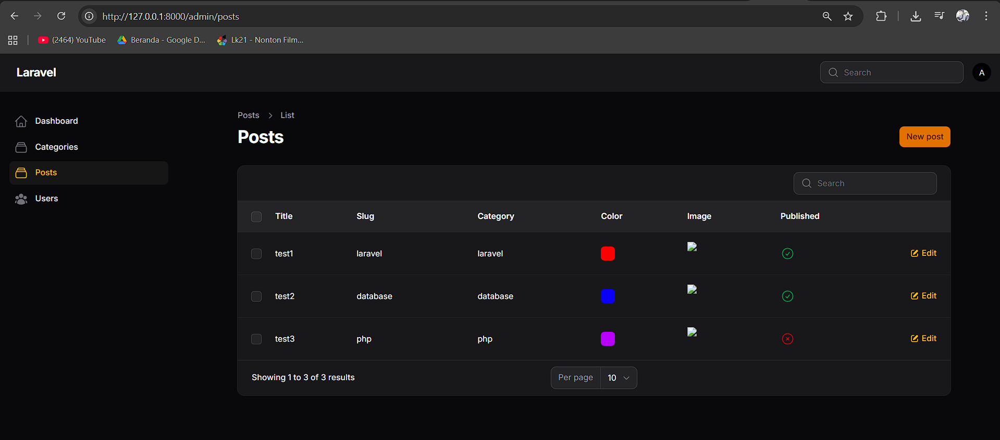
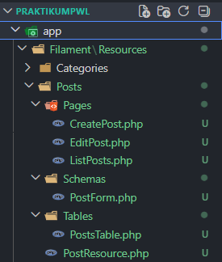

# Laporan Praktikum Pemrograman Web Lanjut
**JobSheet-6 Pertemuan 4 – Implementasi Form Elements & Resource Post di Filament**

**Nama:** [Mokhamad Rizki Hadiono Singgih]  
**NIM:** [ 244107020198 ]  
**Kelas:** [ TI-2F ] 

---

## Implementasi Tugas

### 1. Merancang Validation Rule Pada Form Component
Dalam layer aplikasi, validasi tambahan telah diterapkan di properti TextField `title` dan `slug` dalam file `PostForm.php`. Slug diset `unique` dan title minimal 5 karakter:
```php
TextInput::make('title')
    ->required()
    ->minLength(5),
TextInput::make('slug')
    ->required()
    ->unique(ignoreRecord: true),
```

### 2. Mengintegrasikan Relasi pada Field Select & Checkbox
Menu Category otomatis ditarik relasional menggunakan perintah `options()` dan `published` dikemas dengan mode switch/checkbox otomatis:
```php
Select::make('category_id')
    ->label('Category')
    ->options(\App\Models\Category::all()->pluck('name', 'id'))
    ->required(),
Checkbox::make('published'),
```

### 3. Modifikasi Table Column dan Konfigurasi Gambar
Saya menyesuaikan `PostsTable.php` untuk merender field gambar, dan memunculkan property boolean milik status `published` menjadi icon visual `->boolean()`:
```php
TextColumn::make('title')->searchable(),
TextColumn::make('slug'),
TextColumn::make('category.name'), // Pemanggilan table relasi langsung
ColorColumn::make('color'),
ImageColumn::make('image')->disk('public'),
IconColumn::make('published')->boolean(), // Ikon boolean khusus request
```

### 4. Implementasi Storage Link dan Auto-Redirect
Command `php artisan storage:link` telah dijalankan sehingga storage folder `public/storage` berhasil di-bridging ke public asset. Selain itu, form Create & Edit model disetting redirect secara paksa ke file indeks tabel asalnya:

```php
protected function getRedirectUrl(): string
{
    return $this->getResource()::getUrl('index');
}
```

---

## Hasil Praktikum

**1. Form Create Post**  


**2. Tabel Post**  


**3. Struktur Folder Storage**  


---

## Jawaban Analisis & Diskusi

1. **Mengapa kita perlu `storage:link`?**
   **Jawab:** Secara alami, Laravel mengamankan direktori file internal project sehingga web (user luar) tidak bisa memanggil resource file dari luar folder `public/`. Perintah `storage:link` membuat sebuah *shortcut / symbolic link* yang merutekan folder `storage/app/public/` menuju `public/storage`. Ini memungkinkan browser memuat aset gambar dari request public HTTP yang direpresentasikan Filament tapi sesungguhnya tersimpan aman di server local `storage`.

2. **Apa fungsi `$casts` untuk field JSON?**
   **Jawab:** Karena basis data relational seperti MySQL/SQLite secara fundamental tidak memiliki *Type Variable JSON Native Complex* untuk dikelola dari program backend, data yang masuk sering dikonversikan sebagai String panjang biasa. `$casts` mengubah String ini otomatis menjadi array multi-dimensi (baca & tulis) supaya sistem model PHP (atau elemen *TagsInput* di Filament) bisa menambah dan memodifikasi strukturnya dengan mulus.

3. **Mengapa kita menggunakan `category.name` bukan `category_id`?**
   **Jawab:** Karena di file Entity Framework (Model `Post.php`), relasi `category()` sudah didefinisikan secara *Eloquent ORM* untuk merelasikan *schema Constraint foreign key* ID tabel asal ke detail data spesifik si master Kategori. Dengan menunjuk subtipe `.name`, Filament bisa langsung menampilkan nama kategori asli yang dapat dibaca manusia ketimbang hanya memunculkan ID angka integer statis yang tidak informatif bagi admin.

4. **Apa perbedaan RichEditor dan MarkdownEditor?**
   **Jawab:** Keduanya difungsikan untuk manipulasi body teks panjang, namun:
   - **MarkdownEditor** berbasis syntax kode `#`, `**`, dan `[]()` untuk memformat penulisan (seperti menulis file README.md ini) dan merendernya. Biasanya digunakan bagi tech-driven blog.
   - **RichEditor** *(disingkat: WYSIWYG / What You See Is What You Get)* menggunakan sistem interface tombol klik langsung untuk *bold, italic, list* ala-M$ Word, serta menyimpannya dalam format code asli `<HTML>`. Biasanya nyaman digunakan end-user umum.

---
*Laporan Praktikum Pemrograman Web Lanjut - Framework Filament v4*