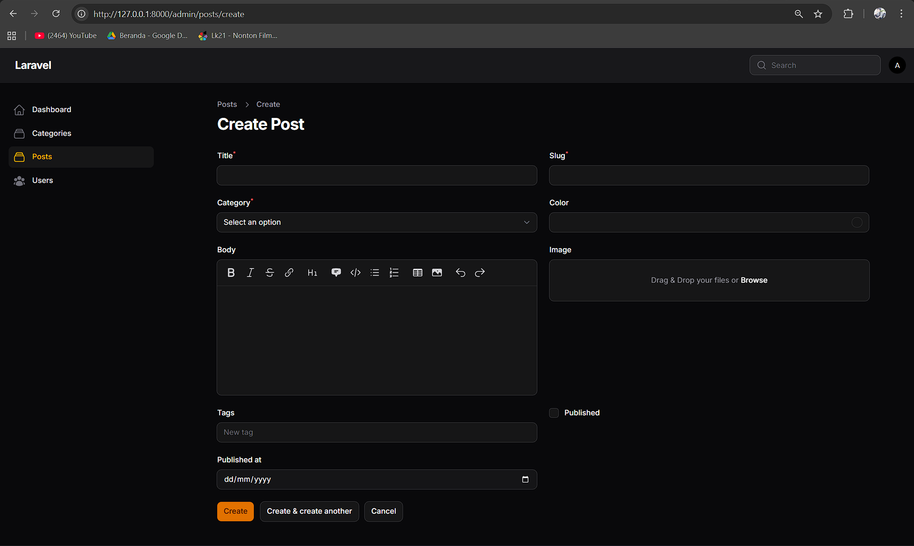
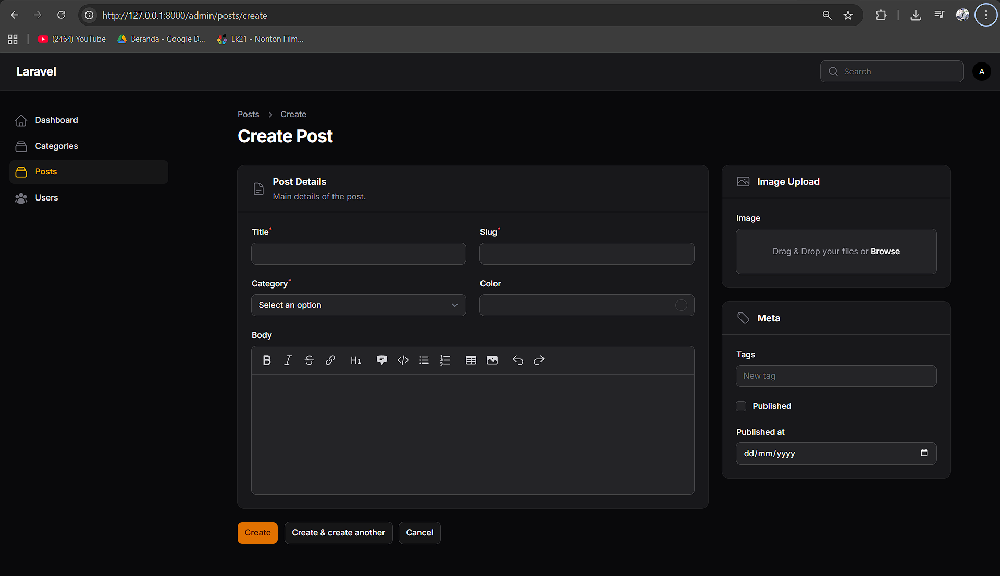

# Laporan Praktikum Pemrograman Web Lanjut
**Jobsheet-6 Pertemuan 5 – Custom Layout Form dengan Section & Group di Filament**

**Nama:** [Mokhamad Rizki Hadiono Singgih]  
**NIM:** [ 244107020198 ]  
**Kelas:** [ TI-2F ]  

---

## Implementasi Tugas Praktikum (Layouting)

Pada `app/Filament/Resources/Posts/Schemas/PostForm.php`, saya merekonstruksi ulang arsitektur layout utamanya menggunakan standar grid 12 kolom milik ekosistem TALL stact / Tailwind, diubah ke partisi grid statis proporsi **2:1**, yaitu:

1. **Schema Utama**
   Keseluruhan Form diatur menggunakan `->columns(3)` sehingga total besaran halaman form input terpecah dalam **3 Kolom Setara**.
2. **Grup Fields Kiri (2/3)**
   Grup komponen ini mengambil `->columnSpan(2)` yang di dalamnya terdapat Section **"Post Details"** *(memakai ikon Document heroicon-o-document-text)*. 
   - Di dalamnya terdapat Grup turunan lagi dengan `columns(2)` sehingga input `Title`, `Slug`, `Category`, dan `ColorPicker` diletakkan merapat sejajar menjadi dua baris di dalam area ini. 
   - Komponen teks *MarkdownEditor* saya deklarasikan atribut mutlak `->columnSpanFull()` agar memanjang dan memenuhi lebar kotak Sectionnya sendiri.
3. **Grup Meta Kanan (1/3)**
   Grup komponen sisa di *sidebar* kanan dibungkus di dalam `->columnSpan(1)`. Ia memuat dua _Section_ vertikal terpisah: 
   - **Section Image Upload** *(ikon: heroicon-o-photo)*.
   - **Section Meta** *(ikon: heroicon-o-tag)* berisi setting status `publish` dan datepicker.

---

## Hasil Praktikum

* **Form Sebelum Layout (Di Jobsheet Sebelumnya)**:  

* **Form Sesudah Layout (Tugas)**:  

---

## Jawaban Analisis & Diskusi

1. **Mengapa layout form penting dalam aplikasi admin?**
   **Jawab:** Mengorganisir elemen secara visual mengurangi apa yang disebut sebagai *cognitive overload* (beban otak user saat memproses begitu banyaknya data). Dengan *layout* yang padat presisi dan _grouping_ berdasar konteks (seperti memisah parameter esensial konten tulisan dan atribut pendukung SEO seperti waktu terbit & gambar), *user* dapat bekerja lebih cepat dan *user experience (UX)* terasa lebih mantap sehingga tingkat _error entry_ jauh berkurang.

2. **Apa perbedaan Section dan Group?**
   **Jawab:**
   - **`Section::make()`** akan melakukan render secara visual di halaman web berupa "kotak pembungkus" lengkap dengan header panel, garis pembatas pinggir, warna latar (card), _border-radius_, opsi ikon, dan juga menyediakan opsi status *collapsible* (bisa dipin/runtuhkan).
   - **`Group::make()`** bersifat transparan secara visual. Tidak akan terlihat bedanya sebagai kotak, tapi ia amat sangat berguna hanya sebagai struktur pembungkus *layout* untuk memaksakan proporsi *grid column* agar berjalan bareng (ber-grup) pada sekelompok komponen.

3. **Kapan kita menggunakan `columnSpanFull()`?**
   **Jawab:** Saat kita ingin elemen memanjang membentang *100% width* terhadap sisa grid wrapper-nya, terlepas dari berapa jumlah `columns()` di atas atau sisi samping kontainernya. Digunakan khusus secara mutlak untuk komponen input yang panjang/tinggi, misal Teks WYSIWYG, Markdown Editor, tabel detail array, dan peta Peta GPS, yang di mana jika komponen-komponen besar ini berada beriringan atau diletakkan padat dalam dua kolom, tampilannya akan menyusut (rusak).

4. **Apa keuntungan sistem grid 12 kolom?**
   **Jawab:** Sistem fleksibilitas *Responsive UI*. Angka 12 adalah angka yang sempurna dalam pembagian karena faktornya banyak. Bisa dibagi jadi 2 set kolom (masing-masing 6), dibagi 3 layout seukuran (masing-masing 4 layout span), dibagi 4 kolom (masing-masing 3 span), atau seperti implementasi kita pada Tugas Form Filament ini: pecahan tak simetris, kiri 8 Grid (alias 2/3 layar) & kanan 4 Grid layar (atau senilai dengan 1/3 layout).

---
*Laporan Praktikum Pemrograman Web Lanjut - Framework Filament v4*