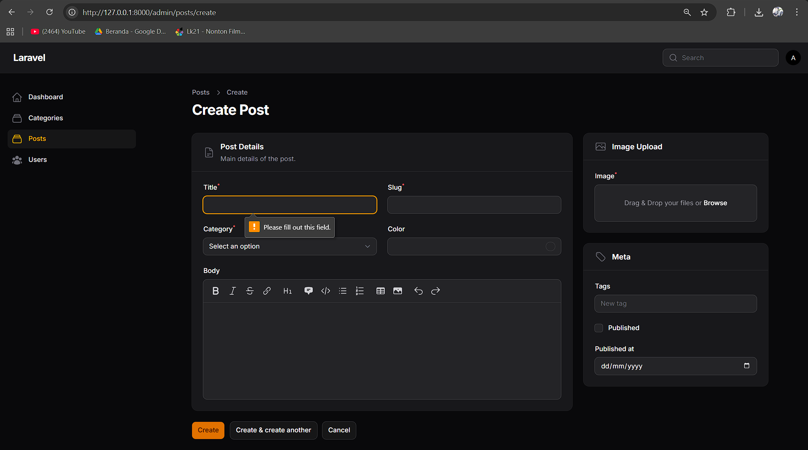
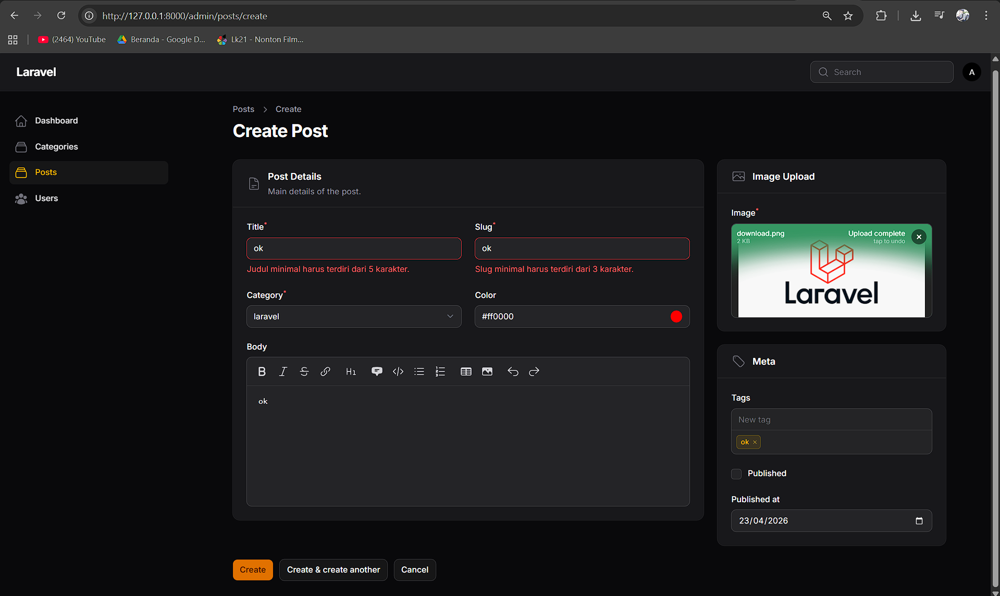
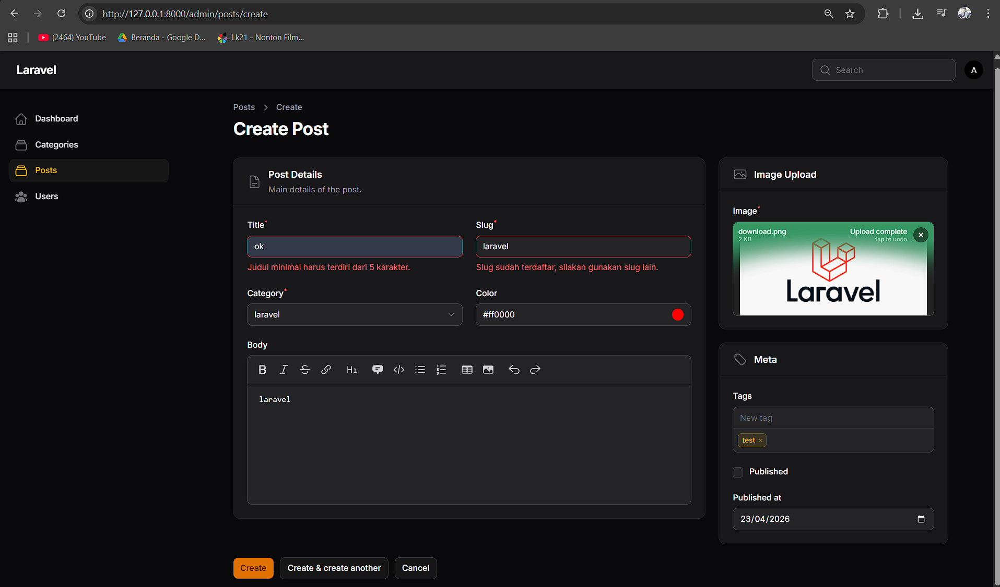

# Laporan Praktikum Pemrograman Web Lanjut
**Pertemuan 6 – Implementasi Form Validation pada Filament**

**Nama:** [Mokhamad Rizki Hadiono Singgih]  
**NIM:** [ 244107020198 ]  
**Kelas:** [ TI-2F ]   

---

## Implementasi Tugas Praktikum (Validasi)

Dalam implementasi kali ini, menyesuaikan _form_ (tampilan input) agar dapat "menolak" proses jika data yang diinputkan pengguna tidak memenuhi kriteria tertentu. 
Pada `app/Filament/Resources/Posts/Schemas/PostForm.php`, logika *rules* serta custom pesannya telah saya ubah menjadi:

### 1. Validasi Input `Title` (Minimal 5 karakter & Wajib Diisi)
```php
TextInput::make('title')
    ->required()               // Wajib isi
    ->rules(['min:5'])         // Rule minimal 5
    ->validationMessages([     // Pesan khusus (Custom)
        'min' => 'Judul minimal harus terdiri dari 5 karakter.',
        'required' => 'Judul dari postingan wajib untuk diisi.',
    ]),
```

### 2. Validasi Input `Slug` (Unik & Minimal 3 karakter & Wajib Diisi)
```php
TextInput::make('slug')
    ->required()               
    ->rules(['min:3'])         // Rule minimal 3 huruf
    ->unique(ignoreRecord: true)  // Unik selain data yang sama (saat update)
    ->validationMessages([
        'unique' => 'Slug sudah terdaftar, silakan gunakan slug lain.',
        'min' => 'Slug minimal harus terdiri dari 3 karakter.',
    ]),
```

### 3. Validasi Input `Category` dan `Image Upload` (Wajib)
Kedua *fields* penting ini sekarang dilindungi dengan method proteksi isi agar user tidak bisa mem*bypass* proses submit form secara sengaja saat kosong.
```php
// Category ID
Select::make('category_id')->required(),

// Image
FileUpload::make('image')
    ->required()
    ->validationMessages([
        'required' => 'Gambar pos wajib untuk diunggah.',
    ]),
```

---

## Hasil Praktikum (Screenshot Tugas / Uji Coba Error)

* **Error *Required*:**  


* **Error *Min Length*:**  
  

* **Error *Unique*:**  
 

---

## Jawaban Analisis & Diskusi

1. **Mengapa validasi penting pada admin panel?**
   **Jawab:** Validasi berguna untuk menjamin kualitas, keamanan, dan integritas data (*Data Integrity*). Jika salah satu admin salah menginput (misal tidak melampirkan foto / tidak terisi judulnya), sistem yang tidak divalidasi akan meneruskan data "cacat/kotor" tersebut ke tampilan publik *(User Frontend)* dan berpotensi memutus / menghancurkan visualisasi *website* pengunjung.

2. **Apa perbedaan validasi _client-side_ dan _server-side_?**
   **Jawab:**
   - **Client-side**: Pengecekan sebelum dikirim yang dilakukan oleh *browser* pengunjung (memanfaatkan tag atribut `required` bawaan HTML5 atau JavaScript murni). Digunakan demi *user-experience* (kecepatan feedback ui), amat rentan di-*bypass/inspect element* dan dimatikan hacker.
   - **Server-side**: Pengecekan inti tingkat tinggi mutlak yang dieksekusi secara ketat oleh Engine Laravel dan Backend Server Database. Sekalipun pengguna menjebol tampilan HTML Frontend, validasi ini tak mungkin bisa dikelabui/ditembus. Filament secara pintar memadukan kedua elemen *layer* tersebut.

3. **Mengapa *unique* otomatis bekerja saat _edit_ data?**
   **Jawab:** Di balik layar Filament, ia mewarisi fungsi proteksi *Rule Validasi Data Builder* milik Laravel. Ketika kita memanggil `->unique()`, dengan bijak secara eksplisit properti ini sudah diposisikan Filament untuk tidak menabrak baris pengulangan (parameter `ignoreRecord:true`). Ia hanya akan mendeteksi apakah `slug` eksis di milik user lain, namun mengizinkan status "Duplicate" jika data rekaman ini tidak diubah tapi ingin melakukan penyimpanan ulang *(_save_)* miliknya sendiri.

4. **Kapan kita perlu menggunakan _rules array_ dibanding _string_?**
   **Jawab:** Keduanya sama-sama memicu pengecekan yang serupa. Namun, *rules format Array* (`->rules(['required', 'min:3', 'max:50'])`) wajib diutamakan jika kondisinya aturan tersebut mengandung parameter **RegEx** / fungsi komplesitas tinggi yang mewajibkan penempatan garis lurus vertikal _Pipe Constraint_ `|`. Jika hanya dipisahkan spasi via format String semata, kode pipeline (*Pipe*) tersebut di syntax Laravel bisa keliru dianggap sebagai pemisah antar-rule oleh *Laravel Engine Parser*.

---
*Laporan Praktikum Pemrograman Web Lanjut - Framework Filament v4*