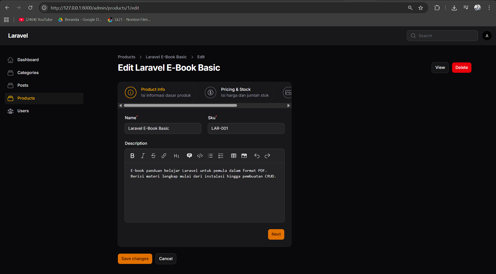
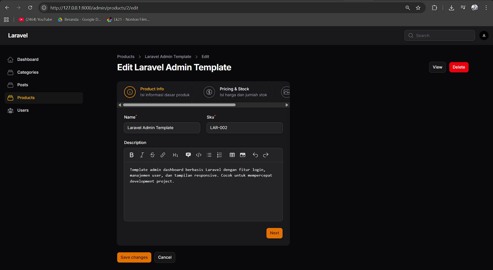
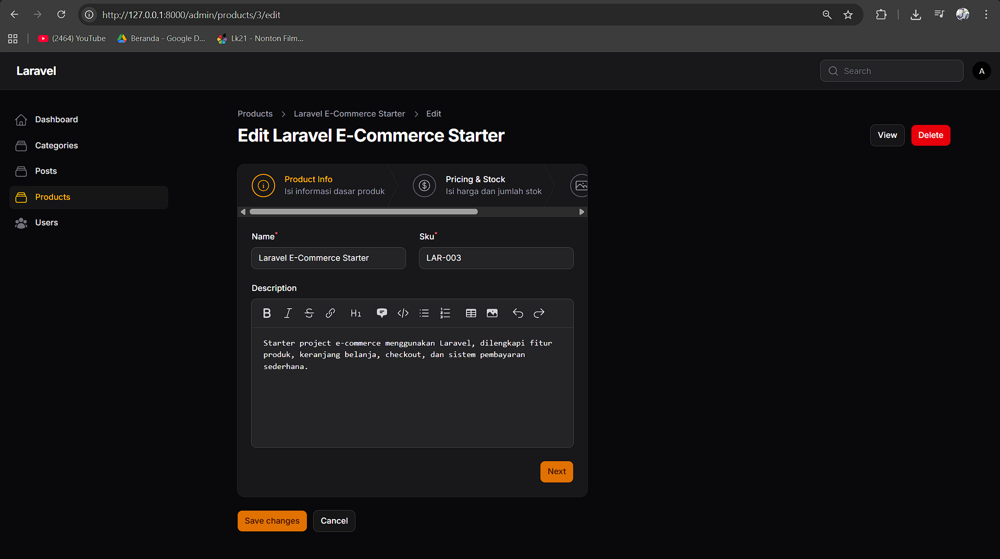
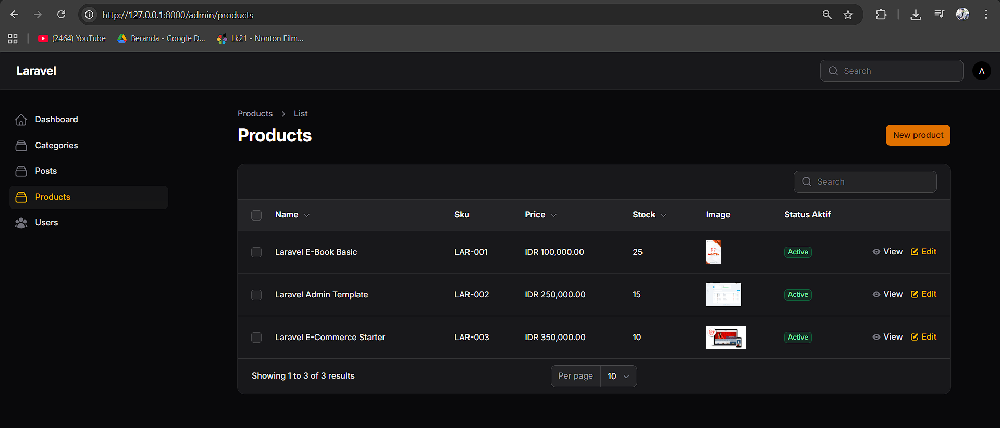

# Laporan Praktikum Pemrograman Web Lanjut
**JobSheet-7 Pertemuan 7 – Implementasi Wizard Form (Multi Step Form) di Filament**

**Nama:** [Mokhamad Rizki Hadiono Singgih]  
**NIM:** [ 244107020198 ]  
**Kelas:** [ TI-2F ]   

---

## Implementasi Tugas Praktikum (Wizard Form)

Dalam implementasi kali ini, pembuatan form data Product menggunakan pendekatan pembagian form menjadi beberapa langkah (step). Form Wizard memecah *input field* panjang ke dalam kategori-kategori spesifik untuk meningkatkan kenyamanan pengisian data (user-friendly).

Berikut detail implementasi yang ditambahkan pada _schema_ `app/Filament/Resources/Products/Schemas/ProductForm.php`:

### 1. Step 1: Product Info
Memuat informasi dasar produk meliputi *Name*, *SKU*, dan *Description*. Menggunakan implementasi Custom Icon juga.
```php
Step::make('Product Info')
    ->icon('heroicon-o-information-circle')
    ->description('Isi informasi dasar produk')
    ->schema([
        Group::make([
            TextInput::make('name')->required(),
            TextInput::make('sku')->required(),
        ])->columns(2),
        MarkdownEditor::make('description')
            ->columnSpanFull(),
    ]),
```

### 2. Step 2: Pricing & Stock
Memuat informasi nominal harga barang dan jumlah ketersediaan dengan perlindungan validasi angka minimal 1 (> 0).
```php
Step::make('Pricing & Stock')
    ->icon('heroicon-o-currency-dollar')
    ->description('Isi harga dan jumlah stok')
    ->schema([
        TextInput::make('price')
            ->numeric()
            ->minValue(1)
            ->required(),
        TextInput::make('stock')
            ->numeric()
            ->required(),
    ]),
```

### 3. Step 3: Media & Status & Submit Button
Memuat *field upload* gambar ke direktori `public` dan *checkbox* persetujuan status. Dilengkapi penambahan `Submit Action` custom di kerangka Wizard utama. Penonaktifan *default action* juga ditambahkan pada `app/Filament/Resources/Products/Pages/CreateProduct.php` dengan fitur *override array*.
```php
Step::make('Media & Status')
    ->icon('heroicon-o-photo')
    ->description('Upload gambar dan atur status')
    ->schema([
        FileUpload::make('image')
            ->disk('public')
            ->directory('products'),
        Checkbox::make('is_active'),
        Checkbox::make('is_featured'),
    ]),
```

---

## Hasil Praktikum

* **Wizard Step 1:**  


* **Wizard Step 2:**  


* **Wizard Step 3:**  


* **Tabel Product:**  


---

## Jawaban Analisis & Diskusi

1. **Mengapa Wizard Form lebih baik untuk form panjang?**
   **Jawab:** Wizard Form memecah entri data *form* yang sangat panjang/rumit (masif) menjadi beberapa potongan bagian berdurasi lebih pendek (*chunking*). Hal ini mengurangi tingkat stres dan pusing layar pada *user interface* (Cognitive Overload) sehingga menuntun alur input demi input memfokuskan mental *user* mengisi tiap elemen secara *step-by-step*. 

2. **Kapan kita menggunakan skippable()?**
   **Jawab:** Method `->skippable()` diterapkan bilamana data-data yang ditanyakan dalam suatu tahapan step bersifat tidak wajib/kondisional (*nullable* opsional). Method ini mengizinkan para user melompati *Step* tahapan tertentu secara eksplisit tanpa harus terhalang teror blokir validasi *required*.

3. **Apa kelebihan multi step dibanding single form panjang?**
   **Jawab:**
   - **Mencegah _User Fatigue_**: Tidak mengharuskan user scroll form tanpa akhir di satu ruang layar tunggal.
   - **Validasi Terstruktur**: Pengecekan error terisolasi langsung pada tahapan itu saja, tidak menunggu hingga seluruh form ratusan data di-klik `Save` baru menumpukkan semua letak *error message*.
   - **Indikator Kemajuan**: Adanya *progress bar* memberi sinyal kepastian (seperti 1 dari 3 Langkah) yang membantu psikologis user menamatkan proses sisanya.

4. **Apakah wizard cocok untuk semua jenis form?**
   **Jawab:** Tidak cocok. *Wizard Form* adalah *Overkill* untuk urusan/entri mendasar yang singkat. Form login biasa, form *reset* password, maupun *subscribe newsletter* akan terhambat dan menduplikasi *clicks* berlebihan jika dipaksa dalam Wizard. Format ini murni ditujukan spesifik untuk *flow* berskala padat layaknya proses *Check-Out* produk, pendaftaran data pelamar lengkap, pembuatan survei kuesioner raksasa, dsb.

---
*Laporan Praktikum Pemrograman Web Lanjut - Framework Filament v4*