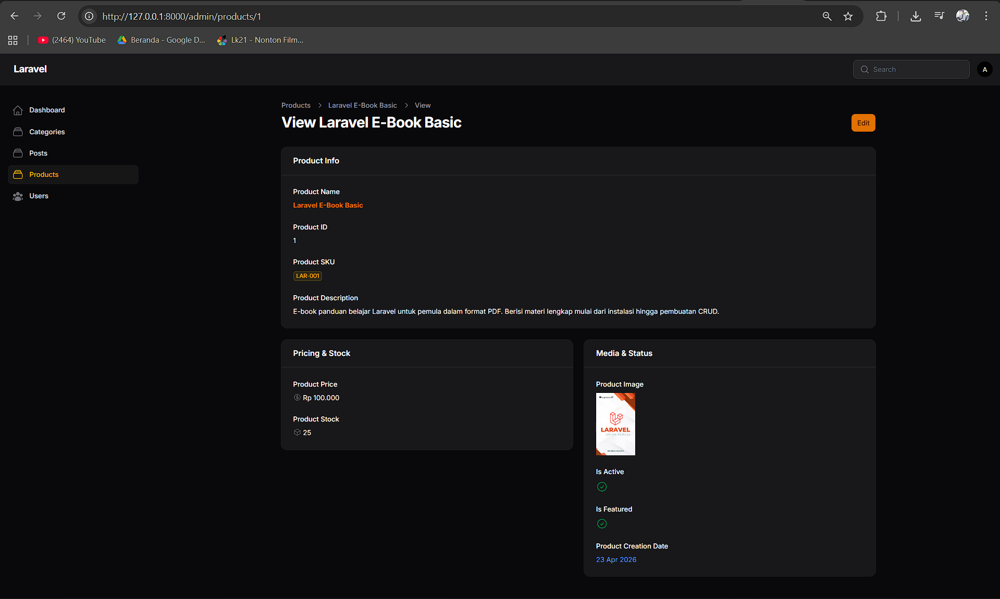
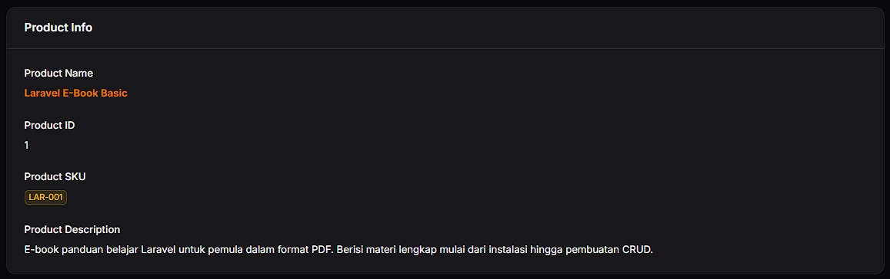
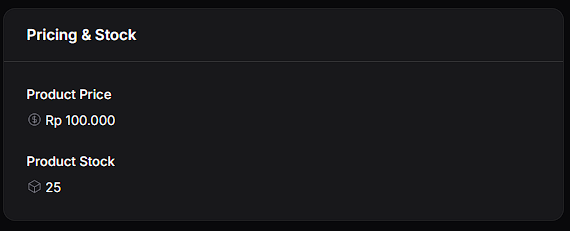
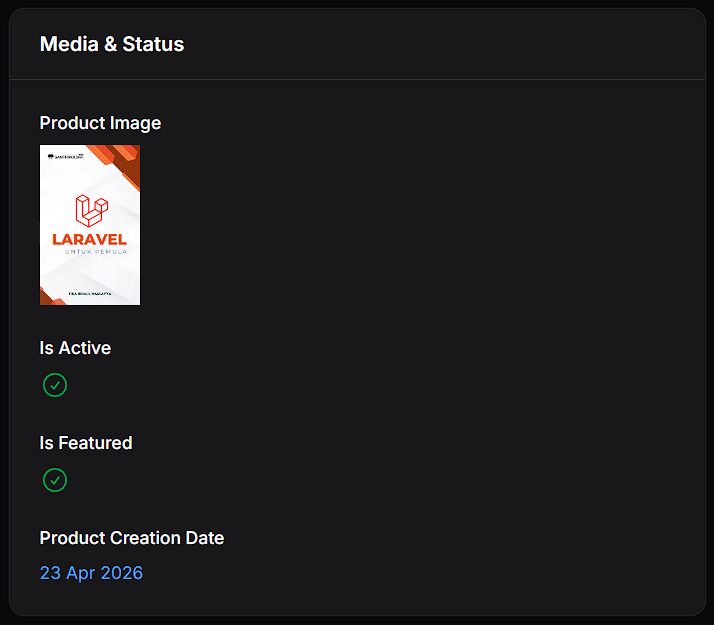

# Laporan Praktikum Pemrograman Web Lanjut
**JobSheet-7 Pertemuan 8 – Implementasi Info List (View Page) di Filament**

**Nama:** [Mokhamad Rizki Hadiono Singgih]  
**NIM:** [ 244107020198 ]  
**Kelas:** [ TI-2F ]   

---

## Implementasi Tugas Praktikum (Info List)

Dalam praktikum kali ini, saya telah mengubah tampilan **View Page** pada halaman `Product` dari _form_ biasa menjadi antarmuka informasi (*read-only display*) menggunakan komponen `InfoList` pada Filament.

Berikut implementasi kode yang saya tambahkan pada komponen *schema* `app/Filament/Resources/Products/Schemas/ProductInfolist.php` untuk membagi tampilan informasinya menjadi 3 bagian (_Sections_):

### 1. Section 1: Product Info (Beserta Latihan Tugas 1)
Pada bagian ini, saya menampilkan `Product Name`, `Product ID`, `Product SKU`, dan `Product Description`. Untuk memenuhi **Tugas Praktikum Poin 1**, `sku` diubah menjadi bentuk status visual menggunakan properti `badge()` dengan modifikasi warna (menggunakan `warning`).
```php
Section::make('Product Info')
    ->schema([
        TextEntry::make('name')
            ->label('Product Name')
            ->weight('bold')
            ->color('primary'),
        TextEntry::make('id')
            ->label('Product ID'),
        TextEntry::make('sku')
            ->label('Product SKU')
            ->badge()
            ->color('warning'), // Tugas 1: Warna badge berbeda
        TextEntry::make('description')
            ->label('Product Description'),
    ])
    ->columnSpanFull(),
```

### 2. Section 2: Pricing & Stock (Beserta Latihan Tugas 2 & 3)
Di _section_ ini, tercantum penunjuk `price` dan `stock`. Saya berhasil mengaplikasikan **Tugas Praktikum Poin 2** (menambahkan *icon* pada *Stock* menggunakan Heroicon) dan **Tugas Praktikum Poin 3** (menambahkan format harga mata uang "Rp" secara spesifik menggunakan *closure* fungsi `formatStateUsing()`).
```php
Section::make('Pricing & Stock')
    ->schema([
        TextEntry::make('price')
            ->label('Product Price')
            ->icon('heroicon-o-currency-dollar')
            ->formatStateUsing(fn ($state) => 'Rp ' . number_format($state, 0, ',', '.')), // Tugas 3: Format Rupiah
        TextEntry::make('stock')
            ->label('Product Stock')
            ->icon('heroicon-o-cube'), // Tugas 2: Tambahkan Icon
    ]),
```

### 3. Section 3: Media & Status 
Menampilkan gambar _Product_ menggunakan `ImageEntry`, indikator boolean interaktif berbasis *check/cross* untuk status menggunakan `IconEntry`, dan penyesuaian format tanggal pembuatannya.
```php
Section::make('Media & Status')
    ->schema([
        ImageEntry::make('image')
            ->label('Product Image')
            ->disk('public'),
        IconEntry::make('is_active')
            ->label('Is Active')
            ->boolean(),
        IconEntry::make('is_featured')
            ->label('Is Featured')
            ->boolean(),
        TextEntry::make('created_at')
            ->label('Product Creation Date')
            ->date('d M Y')
            ->color('info'),
    ]),
```

---

## Hasil Praktikum 

* **Section Product Info:**  




* **Section Pricing & Stock:**  


* **Section Media & Status:**  


---

## Jawaban Analisis & Diskusi

1. **Mengapa View Page tidak cocok menggunakan form input?**
   **Jawab:** Karena *form input* menumpuk layar dengan garis _border/box outline_ tebal untuk meminta tindakan pengguna (kesan *editable*). *View Page* memiliki esensi sebagai alat **baca murni** (_Read-Only_). Menggunakan `InfoList` membuatnya lebih profesional, bersih secara tipografi, sekaligus mencegah resiko *accidental edit* (kesalahan pengubahan yang terklik tidak sengaja oleh _user_)—fokusnya beralih dari interaksi input ke estetik display informasi konkrit.

2. **Apa perbedaan TextColumn dan TextEntry?**
   **Jawab:** Kedua fitur ini sama-sama menampilkan *string/text*. Perbedaan ranahnya adalah: `TextColumn` digunakan spesifik untuk membariskan kolom demi baris di level **Tabel Laporan Dasbor (List Tables)**, sementara `TextEntry` digunakan secara eksklusif untuk mendisplay atribut _single record_ memecah layout secara detail pada layer **Info List (View Page)**.

3. **Kapan kita menggunakan badge?**
   **Jawab:** `badge()` dipanggil / digunakan ketika Anda butuh menonjolkan suatu teks (seperti _tags_, _status_, atau _Identifiers/SKU_ krusial) agar memiliki kontras solid yang memisahkannya dari warna kata-kata yang mendadar (_flat_). Ini mempermudah *skimming* (pembacaan cepat) agar mata admin tertuju ke kotak penanda indikator itu. 

4. **Apa keuntungan menggunakan IconEntry untuk boolean?**
   **Jawab:** Lebih komunikatif memproses data *True/False* secara psikologis lewat simbol (_checkmark_ hijau vs tanda silang _cross_ merah). Memberikan tulisan "1" atau "0" akan membingungkan otak awam untuk memahaminya di dalam hitungan milidetik. *IconEntry* meniadakan gesekan kognitif tersebut secara apik dan interaktif (responsif terhadap warna dan tanda).
   
---
*Laporan Praktikum Pemrograman Web Lanjut - Framework Filament v4*