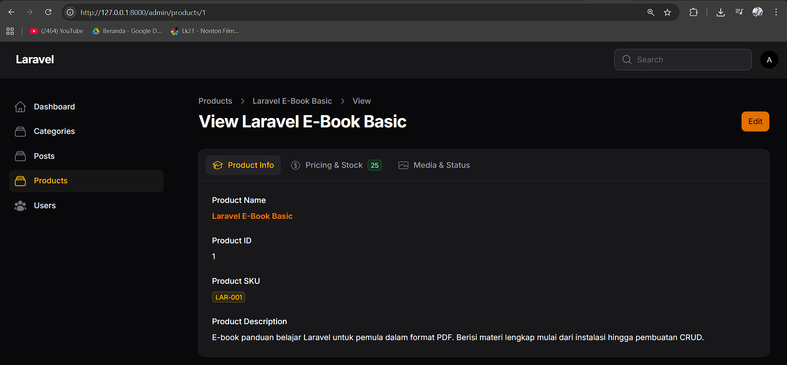
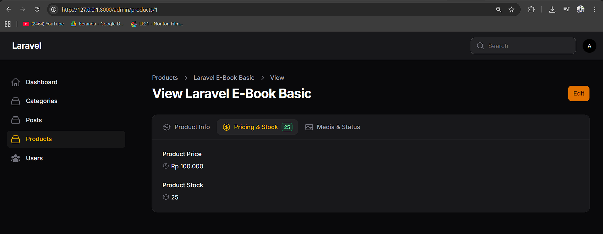
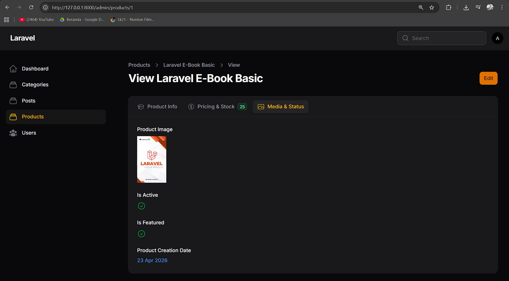
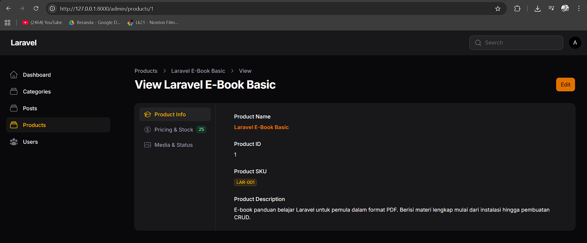
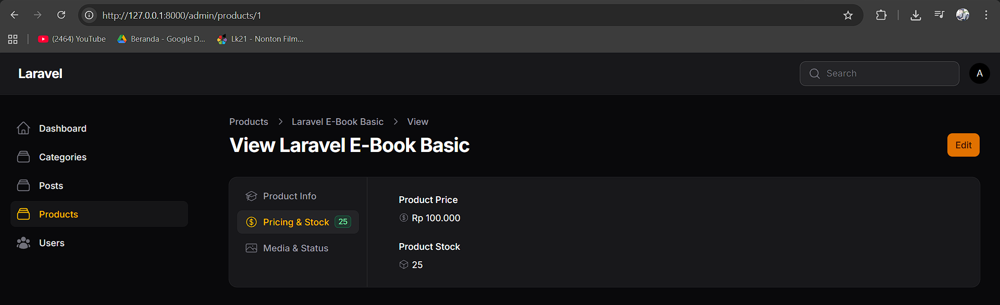
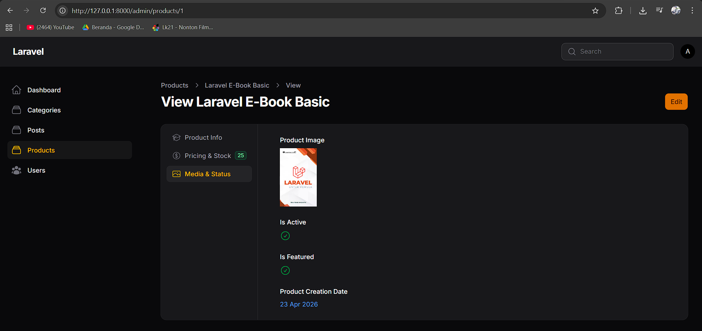
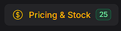

# Laporan Praktikum Pemrograman Web Lanjut
**JobSheet-9 Pertemuan 9 – Implementasi Tabs pada Info List di Filament**

**Nama:** [Mokhamad Rizki Hadiono Singgih]  
**NIM:** [ 244107020198 ]  
**Kelas:** [ TI-2F ]   

---

## Implementasi Tugas Praktikum (Tabs View)

Pada praktikum kali ini, tampilan komponen *View Page* (*InfoList*) yang sebelumnya ditumpuk secara memanjang menggunakan *Section*, sekarang telah dikelompokkan menjadi beberapa layar navigasi melalui pendekatan komponen **Tabs**. 

Berikut implementasi kode modifikasi pada komponen _schema_ `app/Filament/Resources/Products/Schemas/ProductInfolist.php` yang meliputi penggantian *Section* menjadi struktur array `Tab`, penyematan *badge dinamis*, hingga pengubahan orientasi menjadi *vertical*:

```php
Tabs::make('Product Tabs')
    ->vertical() // Menjadikan orientasi tabs berbentuk vertical (Tugas 3)
    ->columnSpanFull()
    ->tabs([

        // TAB 1: PRODUCT INFO
        Tab::make('Product Info')
            ->icon('heroicon-o-academic-cap') // Ikon spesifik (Tugas 4)
            ->schema([
                TextEntry::make('name')
                    ->label('Product Name')
                    ->weight('bold')
                    ->color('primary'),
                TextEntry::make('id')
                    ->label('Product ID'),
                TextEntry::make('sku')
                    ->label('Product SKU')
                    ->badge()
                    ->color('warning'), 
                TextEntry::make('description')
                    ->label('Product Description'),
            ])
            ->columnSpanFull(),

        // TAB 2: PRICING & STOCK
        Tab::make('Pricing & Stock')
            ->icon('heroicon-o-currency-dollar') // Ikon spesifik (Tugas 4)
            ->badge(fn ($record) => $record?->stock ?? 0) // Menambahkan badge angka dinamis stok (Tugas 1)
            ->badgeColor(fn ($record) => ($record?->stock ?? 0) > 10 ? 'success' : 'danger') // Memberikan warna berbeda kondisi khusus (Tugas 2)
            ->schema([
                TextEntry::make('price')
                    ->label('Product Price')
                    ->icon('heroicon-o-currency-dollar')
                    ->formatStateUsing(fn ($state) => 'Rp ' . number_format($state, 0, ',', '.')), 
                TextEntry::make('stock')
                    ->label('Product Stock')
                    ->icon('heroicon-o-cube'), 
            ]),

        // TAB 3: MEDIA & STATUS
        Tab::make('Media & Status')
            ->icon('heroicon-o-photo') // Ikon spesifik (Tugas 4)
            ->schema([
                ImageEntry::make('image')
                    ->label('Product Image')
                    ->disk('public'),
                IconEntry::make('is_active')
                    ->label('Is Active')
                    ->boolean(),
                IconEntry::make('is_featured')
                    ->label('Is Featured')
                    ->boolean(),
                TextEntry::make('created_at')
                    ->label('Product Creation Date')
                    ->date('d M Y')
                    ->color('info'),
            ]),
    ])
```

---

## Hasil Praktikum (Screenshot Tabs View)

* *(Silakan ganti komen orientasi vertical di kode backend `->vertical()` dengan meng-comment-nya sejenak untuk mendapatkan hasil fotonya, lalu kembalikan untuk foto vertikal).*

* **Tabs Horizontal:**  




* **Tabs Vertical:**  




* **Tab dengan Badge Dinamis:**  


---

## Jawaban Analisis & Diskusi

1. **Kapan kita menggunakan Tabs dibanding Section?**
   **Jawab:** Kita menggunakan **Tabs** saat volume detail informasi (*fields/data record*) sangatlah padat hingga membuat tinggi halaman terdorong jauh *(Scroll Fatigue)*. Kebalikannya, **Section** digunakan saat kelompok-kelompok data jumlahnya masih sewajarnya terjangkau oleh mata/layar secara serempak tanpa perlu berinteraksi (navigasi mandiri).

2. **Apa kelebihan Tabs untuk data panjang?**
   **Jawab:**
   - **Meningkatkan Aksesibilitas (Ringkas):** Layar antarmuka tidak ter-banjiri data. Area kosong disembunyikan sampai pengguna memang membutuhkan datanya.
   - **Efisiensi Navigasi Kelas Profesional:** Admin tidak perlu men-*scroll-scroll* panik. Cukup klik klasifikasi *(tab label/icon)* yang ia incar, seketika informasinya muncul.
   - **Organisasi Logis:** Mampu diimbuhi komponen tambahan asik seperti *badges* di bilah tab yang memperingatkan nilai metrik (contoh ada notifikasi stok rendah `danger` dsb) sebelum tab diklik.

3. **Apakah Tabs bisa digunakan pada Form juga?**
   **Jawab:** **Tentu saja bisa.** Filament memiliki ekuivalensi desain UI antara _Forms_ dan _Infolists_. Pada builder *Form*, kita bisa memanggil fungsi _layout_ yang serupa yaitu `Filament\Forms\Components\Tabs` ketimbang *Wizard* apabila kita ingin input data secara horizontal / acak lintas bagian tanpa restriksi sekuensial "Next-Previous" wajib ala _Wizard_.

4. **Bagaimana jika tab terlalu banyak?**
   **Jawab:** Pengalaman pengguna (*User Experience* / UX) menjadi rentan gagal jika label tab membeludak (_overflowing_), meluber ke ujung layar (_wrap_ hancur) atau membuat ikon tidak teridentifikasi. Jika melampaui > 6 tab, lebih bijak dikelompokkan ke layer hierarki yang baru (menggunakan fitur Menu/Sidebar _Relation Manager_ interaktif, atau dikombinasikan dengan campuran _Section_ di tiap Tabs agar kategori induk ditekan jumlahnya).
   
---
*Laporan Praktikum Pemrograman Web Lanjut - Framework Filament v4*